# [MS-NRBF]: .NET Remoting: Binary Format Data Structure

| Section             | Table of Contents                                |
|---------------------|--------------------------------------------------|
| 1                   | Introduction                                     |
| 1.1                 | Glossary                                         |
| 1.2                 | References                                       |
| 1.2.1               | Normative References                             |
| 1.2.2               | Informative References                           |
| 1.3                 | Overview                                         |
| 1.4                 | Relationship to Protocols and Other Structures   |
| 1.5                 | Applicability Statement                          |
| 1.6                 | Versioning and Localization                      |
| 1.7                 | Vendor-Extensible Fields                         |
| 2                   | Structures                                       |
| 2.1                 | Common Definitions                               |
| 2.1.1               | Common Data Types                                |
| 2.1.1.1             | Char                                             |
| 2.1.1.2             | Double                                           |
| 2.1.1.3             | Single                                           |
| 2.1.1.4             | TimeSpan                                         |
| 2.1.1.5             | DateTime                                         |
| 2.1.1.6             | LengthPrefixedString                             |
| 2.1.1.7             | Decimal                                          |
| 2.1.1.8             | ClassTypeInfo                                    |
| 2.1.2               | Enumerations                                     |
| 2.1.2.1             | RecordTypeEnumeration                            |
| 2.1.2.2             | BinaryTypeEnumeration                            |
| 2.1.2.3             | PrimitiveTypeEnumeration                         |
| 2.2                 | Method Invocation Records                        |
| 2.2.1               | Enumerations                                     |
| 2.2.1.1             | MessageFlags                                     |
| 2.2.2               | Common Structures                                |
| 2.2.2.1             | ValueWithCode                                    |
| 2.2.2.2             | StringValueWithCode                              |
| 2.2.2.3             | ArrayOfValueWithCode                             |
| 2.2.3               | Record Definitions                               |
| 2.2.3.1             | BinaryMethodCall                                 |
| 2.2.3.2             | MethodCallArray                                  |
| 2.2.3.3             | BinaryMethodReturn                               |
| 2.2.3.4             | MethodReturnCallArray                            |
| 2.3                 | Class Records                                    |
| 2.3.1               | Common Structures                                |
| 2.3.1.1             | ClassInfo                                        |
| 2.3.1.2             | MemberTypeInfo                                   |
| 2.3.2               | Record Definitions                               |
| 2.3.2.1             | ClassWithMembersAndTypes                         |
| 2.3.2.2             | ClassWithMembers                                 |
| 2.3.2.3             | SystemClassWithMembersAndTypes                   |
| 2.3.2.4             | SystemClassWithMembers                           |
| 2.3.2.5             | ClassWithId                                      |
| 2.4                 | Array Records                                    |
| 2.4.1               | Enumerations                                     |
| 2.4.1.1             | BinaryArrayTypeEnumeration                       |
| 2.4.2               | Common Definitions                               |
| 2.4.2.1             | ArrayInfo                                        |
| 2.4.3               | Record Definitions                               |
| 2.4.3.1             | BinaryArray                                      |
| 2.4.3.2             | ArraySingleObject                                |
| 2.4.3.3             | ArraySinglePrimitive                             |
| 2.4.3.4             | ArraySingleString                                |
| 2.5                 | Member Reference Records                         |
| 2.5.1               | MemberPrimitiveTyped                             |
| 2.5.2               | MemberPrimitiveUnTyped                           |
| 2.5.3               | MemberReference                                  |
| 2.5.4               | ObjectNull                                       |
| 2.5.5               | ObjectNullMultiple                               |
| 2.5.6               | ObjectNullMultiple256                            |
| 2.5.7               | BinaryObjectString                               |
| 2.6                 | Other Records                                    |
| 2.6.1               | SerializationHeaderRecord                        |
| 2.6.2               | BinaryLibrary                                    |
| 2.6.3               | MessageEnd                                       |
| 2.7                 | Binary Record Grammar                            |
| 3                   | Structure Examples                               |
| 4                   | Security Considerations                          |
| 5                   | Appendix A: Product Behavior                     |
| 6                   | Change Tracking                                  |
| 7                   | Index                                            |

## 1 Introduction

The .NET Remoting: Binary Format Data Structure defines a set of structures that represent **object** graph or method invocation information as an octet stream. One possible application of the structure is as the **serialization format** for the data model as specified in [MS-NRTP] section 3.1.1. Sections 1.7 and 2 of this specification are normative. All other sections and examples in this specification are informative.

## 1.1 Glossary

This document uses the following terms:
argument: A named **Data Value** that is passed as part of a **Remote Method** invocation or returned as part of the results of a **Remote Method** invocation. For more information about Remote Method invocation, see [MS-NRTP] section 3.1.1.

**array**: A **Remoting Type** that is an ordered collection of values. The values are identified by their position and position is determined by a set of integer indices. The number of indices required to represent the position is called the Rank of the **Array**. An **Array** is part of the **Remoting Data** Model and also specifies the **Remoting Type** of its items. For more information, [MS-NRTP] section 3.1.1.

**Call Context**: A mechanism to pass data that is not part of the method **Arguments** between client and server. It is a collection of name-value pairs that is carried with the execution of a **Remote** Method. This collection is sent along with other method **Arguments** from client to server, and is transmitted back, along with the **Return Values** and output **Arguments**, from the server to the client. For more information, see [MS-NRTP] section 1.3.

**class**: (1) A **Remoting Type** that encapsulates a set of named values and a set of methods that operate on those values. The named values are called Members of the Class. A Class is part of the **Remoting Data Model**. For more information, see [MS-NRTP] section 3.1.1. (2) See System.Object.

**Class Metadata**: Information about a Class that includes the Class name, its Library name, and the names and Remoting Types of its Members.

**Coordinated Universal Time (UTC)**: A high-precision atomic time standard that approximately tracks Universal Time (UT). It is the basis for legal, civil time all over the Earth. Time zones around the world are expressed as positive and negative offsets from UTC. In this role, it is also referred to as Zulu time (Z) and Greenwich Mean Time (GMT). In these specifications, all references to UTC refer to the time at UTC-0 (or GMT).

**data value**: An instance of a **Remoting Type**, which may be a Class, Array, **Enum**, or Primitive. A **Data Value** is part of the **Remoting Data Model**. For more information, see [MS-NRTP] section 3.1.1.

**deserialize**: See unmarshal.

**Enum**: A Primitive type whose members are constrained to a set of values. The Primitive type is considered to be an underlying **Remoting Type** of the **Enum**. Each value has a name associated with it. An **Enum** is part of the **Remoting Data Model**, and an abbreviation for "enumeration." For more information, see [MS-NRTP] section 3.1.1.

**Exception**: A **Class** that indicates an error in the execution of a **Remote Method**. It is sent as part of the return message from a server to a client. An **Exception** contains a human-readable message that indicates what the error is, and can also have additional data to identify the error. An **Exception** is part of the **Remoting Data Model**. For more information, see [MS-NRTP] section 3.1.1.

**Generic Argument**: A formal argument used in a **Generic Type** or a **Generic Remote Method**
to represent a parameterized Remoting Type. **Generic Arguments** can be referenced in the Class or the method as opaque **Remoting Types**. They are replaced by the actual types when the **Class** or the method is used. For more information, see Generic Type and Methods in [ECMA-335].

**Generic Remote Method**: A **Remote Method** that is parameterized by one or more Remoting Types. The method caller must provide the actual **Remoting Types** (in addition to the Input Arguments). For more information, see [MS-NRTP] section 3.1.1.

**Generic Type**: A Class, **Server Type**, or Server Interface that is parameterized by one or more Remoting Types. A **Generic Type** contains GenericArguments as a placeholder for the parameterized **Remoting Types**. A **Generic Type** cannot have any instances. For more information, see Generic Types and Methods in [ECMA-335].

**Input Argument**: A named **Data Value** that is passed as part of a **Remote Method** invocation from the client to the server. For more information, see **Remote Method** in the Abstract Data Model (section 3.1.1).

**Library**: Part of the **Remoting Data Model**. A **Library** is a named unit that contains a collection of **Remoting Types**. For more information, see Library in [MS-NRTP] section 3.1.1.

**little-endian**: Multiple-byte values that are byte-ordered with the least significant byte stored in the memory location with the lowest address.

**local time zone**: The time zone in which the computer running the implementation is configured.

**logical call ID**: An optional string value that identifies the logical thread of execution. This value is passed as part of the **Call Context** and can be used in implementation-specific local threading models on the server.

**member**: See **Class**.

**message content**: The **serialized** body of a message. 

**Message Properties**: A collection of implementation-specific, name-value pairs that are transmitted as part of a **Remote Method** invocation. **Message Properties** are used to exchange implementation-specific data between clients and servers.

**method signature**: A list of the remoting types of the arguments of a remote method.

**Null Object**: Part of the Remoting Data Model. **Null Object** is a special value that can be used in place of an instance of a Class, **Array**, or String. It indicates that no instance is being specified. For more information, see [MS-NRTP] section 3.1.1.

**object graph**: In object-oriented programming, groups of interrelated objects that form a network through often complex relationships with each other are known as an object graph. In an object graph, objects can be linked to each other by a specific object, by owning or containing another object, or by holding a reference to another object. Such an abstract structure can be used to represent the state of an application.

**Output Argument**: A named **Data Value** that is returned as part of the results of a Remote Method invocation. For more information, see **Remote Method** in Abstract Data Model (section 3.1.1).

**Primitive Type**: Part of the Remoting Data Model. **Primitive Types** are predefined **Remoting Types** such as Byte, Int16, Int32, Int64, and so on. For more information, see [MS-NRTP] section 3.1.1

**Primitive Value**: Part of the **Remoting Data Model**. A **Primitive Value** is an instance of a Primitive Type.

**record**: A variable-length sequence of bytes with a predefined structure.

**Remote Method**: Part of the **Remoting Data Model**. A **Remote Method** is a remotely callable operation. A **Remote Method** can either be One-Way or Two-Way. In the case of a One-Way Method, there is no reply from the implementation. For more information, see [MS-NRTP] section 3.1.1

**Remoting Data Model**: A model that is used to represent higher-layer–defined data structures and values, and to represent a **Remote Method** invocation and the **Return Value** or error information from that invocation. A protocol, such as [MS-NRLS], that is built on top of this protocol can be defined by using the **Remoting Data Model**, and can be agnostic to the serialization format. For more information, see Abstract Data Model (section 3.1.1).

**Remoting Type**: Part of the Remoting Data Model. Class, Array, **Enum**, and Primitive are different kinds of **Remoting Types**. All **Remoting Types** are identified by a name that is case sensitive. For more information, see [MS-NRTP] section 3.1.1 

**Return Value**: A **Data Value** that is returned as part of the results of a **Remote Method**
invocation. For more information, see **Remote Method** in Abstract Data Model (section 3.1.1).

**serialization**: A mechanism by which an application converts an object into an XML 
representation.

**Serialization Format**: The structure of the serialized message content, which can be either binary or SOAP. Binary serialization format is specified in [MS-NRBF]. SOAP serialization format is specified in [MS-NRTP].

**Serialization Stream**: An octet stream that contains a sequence of records defined in this document.

**serialize**: The process of taking an in-memory data structure, flat or otherwise, and turning it into a flat stream of bytes. See also marshal.

**Server Type**: Part of the **Remoting Data Model**. A **Server Type** contains **Remote Methods**.

**System Library**: A specially designated **library** that can be used to reduce the wire size for commonly used data types. The name of the **library** is agreed to by both the server and the client.

**System.Object**: Part of the Remoting Data Model. **System.Object** is a **Class** that has no Members. A **Class** that does not extend another **Class** is considered to extend System.Object.

**Ultimate Array Item Type**: The Item Type of the innermost Array in a recursive construction of Array of Arrays. For instance, an "Array of TypeA" has an Ultimate Array Item Type of TypeA. An "Array of Array of TypeA" also has an Ultimate Array Item Type of TypeA, as does an "Array of Array of Array of TypeA".

**Unicode**: A character encoding standard developed by the Unicode Consortium that represents almost all of the written languages of the world. The **Unicode** standard [UNICODE5.0.0/2007] provides three forms (UTF-8, UTF-16, and UTF-32) and seven schemes (UTF-8, UTF-16, UTF-16 BE, UTF-16 LE, UTF-32, UTF-32 LE, and UTF-32 BE).

**UTF-8**: A byte-oriented standard for encoding Unicode characters, defined in the Unicode standard. Unless specified otherwise, this term refers to the UTF-8 encoding form specified in [UNICODE5.0.0/2007] section 3.9.

MAY, SHOULD, MUST, SHOULD NOT, MUST NOT: These terms (in all caps) are used as defined in [RFC2119]. All statements of optional behavior use either MAY, SHOULD, or SHOULD NOT.

## 1.2 References

Links to a document in the Microsoft Open Specifications library point to the correct section in the most recently published version of the referenced document. However, because individual documents in the library are not updated at the same time, the section numbers in the documents may not match. You can confirm the correct section numbering by checking the Errata. 

## 1.2.1 Normative References

- [IEEE754] IEEE, "IEEE Standard for Binary Floating-Point Arithmetic", IEEE 754-1985, October 1985, http://ieeexplore.ieee.org/servlet/opac?punumber=2355
- [MS-DTYP] Microsoft Corporation, "Windows Data Types". 
- [MS-NRTP] Microsoft Corporation, ".NET Remoting: Core Protocol". 
- [RFC2119] Bradner, S., "Key words for use in RFCs to Indicate Requirement Levels", BCP 14, RFC 2119, March 1997, http://www.rfc-editor.org/rfc/rfc2119.txt 
- [RFC4234] Crocker, D., Ed., and Overell, P., "Augmented BNF for Syntax Specifications: ABNF", RFC 4234, October 2005, http://www.rfc-editor.org/rfc/rfc4234.txt

## 1.2.2 Informative References

- [MS-NETOD] Microsoft Corporation, "Microsoft .NET Framework Protocols Overview". 
- [MSDN-.NET-FRAMEWORK] Microsoft Corporation, "Overview of the .NET Framework", http://msdn.microsoft.com/en-us/library/zw4w595w.aspx

## 1.3 Overview

The .NET Remoting: Binary Format Data Structure defines a set of structures that represent **object graph** or method invocation information as an octet stream. One possible application of the structure is as the serialization format for the data model as specified in [MS-NRTP] section 3.1.1. 

This specification defines the **records** used by this format, and the grammar for writing the records to the **serialization stream**. 

The format provides structures for mapping instances of data that conform to the **Remoting Data Model** into octets. The Remoting Data Model is specified in [MS-NRTP] section 3.1.1. 

The format consists of a sequence of variable-length records. The records are used to hold the **serialized** instances of **Classes (2)**, **Arrays**, **Primitive Types**, and method invocations. There are multiple record types to represent each of these instances. The various record types optimize the wire size of the serialized instance. This section specifies the structure of each record in detail. For clarity, the records are grouped as follows:

- Class (2) records contain Class (2) instances. The format allows serialization of **Class Metadata**, 
in addition to the actual data. Richness of metadata directly contributes to the wire size. The amount of metadata can be reduced by conveying implicit information through special record types and by sharing metadata across records.

- Array records contain Array instances. There is a general record type for Array that can represent multiple dimensions and nonzero lower bound. There are more compact Array records for frequently used Array types such as single-dimensional Array of String, Object, and **Primitive Values**.

- **Members** reference records contain **Data Values** of Class (2) Members or Array items. There are different record types for **Null Object**, string values, Primitive Type values, and instances of Classes (2) and Arrays.

- Method invocation records contain information about **Remote Method**, **Server Type**, 
**Arguments**, **Return Value**, **Exception**, **Message Properties**, and **Call Context**.

- Other records include records that are used to mark the beginning and end of the format.

## 1.4 Relationship To Protocols And Other Structures

This format is part of the .NET Remoting protocols. The .NET Remoting Protocol (as specified in [MSNRTP]) uses this format to encode **message content** before transmission, as specified in [MS-NRTP] section 3. 

The **serialized** content is transmitted over either HTTP or TCP, by using headers and framing as specified in [MS-NRTP] section 3. The following block diagram illustrates the relationship.

| Figure 1: The .NET Remoting protocols   |
|-----------------------------------------|

## 1.5 Applicability Statement

The .NET Remoting: Binary Format Data Structure can be used as part of a **Remote Method** invocation protocol or to persist an **object graph**. It has a compact octet stream representation that makes it applicable to wire protocols. Because the format is binary, it is not suitable for cases where the output has to be human readable. The format does not include additional information to aid in error detection or to prevent corruption.

## 1.6 Versioning And Localization

This document covers versioning issues in the following areas:

- Protocol Versions: The Serialization Header record has fields called **MajorVersion** and **MinorVersion** that denote the version of the .NET Remoting: Binary Format Data Structure in use. Because only one version of the .NET Remoting: Binary Format Data Structure has been defined to date, the value of **MajorVersion** is always set to 1 and **MinorVersion** to 0. Future revisions of the format would increment this value. The Serialization Header record is specified in section 2.6.1.

- Message Versions: MessageFlags (section 2.2.1.1) defines a flag named "Generic Method". The flag indicates that the method being invoked is a **Generic Remote Method**. The flag is valid only in Microsoft .NET Framework 2.0, Microsoft .NET Framework 3.0, Microsoft .NET Framework 3.5, and Microsoft .NET Framework 4.0. For more information, see [MSDN-.NET-FRAMEWORK]. 

There are no localization-dependent structures described in this document.

## 1.7 Vendor-Extensible Fields

This format allows implementation-specific name-value pairs called **Message Properties** to be added to the MethodCallArray (section 2.2.3.2) and MethodReturnCallArray (section 2.2.3.4) records.

___
# 2 Structures

## 2.1 Common Definitions

The following sections specify the common structures and enumerations that are used by all records.

## 2.1.1 Common Data Types

This section specifies the structures of the common **Remoting Types** that are supported by this format. The format supports the following **Primitive Types** as specified in [MS-DTYP]:

- BOOLEAN
- BYTE 
- INT8 
- INT16 
- INT32 
- INT64 
- UINT16 
- UINT32 
- UINT64 

The byte-ordering of the multibyte data types is **little-endian**. The signed data types use two's complement to represent the negative numbers. 
In addition, this format defines the following common types.

## 2.1.1.1 Char

The Char represents a **Unicode** character value.

<table border="1">
  <thead>
    <tr>
      <th>0</th>
      <th>1</th>
      <th>2</th>
      <th>3</th>
      <th>4</th>
      <th>5</th>
      <th>6</th>
      <th>7</th>
      <th>8</th>
      <th>9</th>
      <th>1 0</th>
      <th>1</th>
      <th>2</th>
      <th>3</th>
      <th>4</th>
      <th>5</th>
      <th>6</th>
      <th>7</th>
      <th>8</th>
      <th>9</th>
      <th>2 0</th>
      <th>1</th>
      <th>2</th>
      <th>3</th>
      <th>4</th>
      <th>5</th>
      <th>6</th>
      <th>7</th>
      <th>8</th>
      <th>9</th>
      <th>3 0</th>
      <th>1</th>
    </tr>
  </thead>
  <tbody>
    <tr>
        <td align="center" colspan="32">Value (variable)</td>
    </tr>
    <td align="center" colspan="32">...</td>
  </tbody>
</table>

**Value (variable):** UTF-8-encoded bytes.

## 2.1.1.2 Double

The Double represents a 64-bit double-precision floating-point value.

<table border="1">
  <thead>
    <tr>
      <th>0</th>
      <th>1</th>
      <th>2</th>
      <th>3</th>
      <th>4</th>
      <th>5</th>
      <th>6</th>
      <th>7</th>
      <th>8</th>
      <th>9</th>
      <th>1 0</th>
      <th>1</th>
      <th>2</th>
      <th>3</th>
      <th>4</th>
      <th>5</th>
      <th>6</th>
      <th>7</th>
      <th>8</th>
      <th>9</th>
      <th>2 0</th>
      <th>1</th>
      <th>2</th>
      <th>3</th>
      <th>4</th>
      <th>5</th>
      <th>6</th>
      <th>7</th>
      <th>8</th>
      <th>9</th>
      <th>3 0</th>
      <th>1</th>
    </tr>
  </thead>
  <tbody>
    <tr>
        <td align="center" colspan="32">Value</td>
    </tr>
    <td align="center" colspan="32">...</td>
  </tbody>
</table>

**Value (8 bytes):** A 64-bit double-precision floating-point value, as specified in [IEEE754].

## 2.1.1.3 Single

The Single represents a 32-bit single-precision floating-point value.

<table border="1">
  <thead>
    <tr>
      <th>0</th>
      <th>1</th>
      <th>2</th>
      <th>3</th>
      <th>4</th>
      <th>5</th>
      <th>6</th>
      <th>7</th>
      <th>8</th>
      <th>9</th>
      <th>1 0</th>
      <th>1</th>
      <th>2</th>
      <th>3</th>
      <th>4</th>
      <th>5</th>
      <th>6</th>
      <th>7</th>
      <th>8</th>
      <th>9</th>
      <th>2 0</th>
      <th>1</th>
      <th>2</th>
      <th>3</th>
      <th>4</th>
      <th>5</th>
      <th>6</th>
      <th>7</th>
      <th>8</th>
      <th>9</th>
      <th>3 0</th>
      <th>1</th>
    </tr>
  </thead>
  <tbody>
    <td align="center" colspan="32">Value</td>
  </tbody>
</table>

**Value (4 bytes):** A 32-bit single-precision floating-point value, as specified in [IEEE754].

## 2.1.1.4 Timespan

The TimeSpan represents time duration.

<table border="1">
  <thead>
    <tr>
      <th>0</th>
      <th>1</th>
      <th>2</th>
      <th>3</th>
      <th>4</th>
      <th>5</th>
      <th>6</th>
      <th>7</th>
      <th>8</th>
      <th>9</th>
      <th>1 0</th>
      <th>1</th>
      <th>2</th>
      <th>3</th>
      <th>4</th>
      <th>5</th>
      <th>6</th>
      <th>7</th>
      <th>8</th>
      <th>9</th>
      <th>2 0</th>
      <th>1</th>
      <th>2</th>
      <th>3</th>
      <th>4</th>
      <th>5</th>
      <th>6</th>
      <th>7</th>
      <th>8</th>
      <th>9</th>
      <th>3 0</th>
      <th>1</th>
    </tr>
  </thead>
  <tbody>
    <tr>
        <td align="center" colspan="32">Value</td>
    </tr>
    <td align="center" colspan="32">...</td>
  </tbody>
</table>

**Value (8 bytes):** A 64-bit signed-integer value that specifies duration as the number of 100 nanoseconds. The values range from -10675199 days, 2 hours, 48 minutes, and 05.4775808 seconds to 10675199 days, 2 hours, 48 minutes, and 05.4775807 seconds inclusive.

## 2.1.1.5 Datetime

The DateTime represents an instant of time.

<table border="1">
  <thead>
    <tr>
      <th>0</th>
      <th>1</th>
      <th>2</th>
      <th>3</th>
      <th>4</th>
      <th>5</th>
      <th>6</th>
      <th>7</th>
      <th>8</th>
      <th>9</th>
      <th>1 0</th>
      <th>1</th>
      <th>2</th>
      <th>3</th>
      <th>4</th>
      <th>5</th>
      <th>6</th>
      <th>7</th>
      <th>8</th>
      <th>9</th>
      <th>2 0</th>
      <th>1</th>
      <th>2</th>
      <th>3</th>
      <th>4</th>
      <th>5</th>
      <th>6</th>
      <th>7</th>
      <th>8</th>
      <th>9</th>
      <th>3 0</th>
      <th>1</th>
    </tr>
  </thead>
  <tbody>
    <tr>
        <td align="center" colspan="32">Ticks</td>
    </tr>
    <td align="center" colspan="30">...</td>
    <td align="center" colspan="2">Kind</td>
  </tbody>
</table>

**Ticks (62 bits):** A 62-bit signed-integer value that specifies the number of 100 nanoseconds that have elapsed since 12:00:00, January 1, 0001. The value can represent time instants in a granularity of 100 nanoseconds until 23:59:59.9999999, December 31, 9999.

**Kind (2 bits):** Provides the time-zone information as follows. The value can range from 0 to 2, inclusive<1>. The following table maps values with the meaning of the **Ticks** field.

| Value   | Meaning                                                                  |
|---------|--------------------------------------------------------------------------|
| 0       | Time-zone information is not specified.                                  |
| 1       | The time specified is in the Coordinated Universal Time (UTC) time zone. |
| 2       | The time specified is in the local time zone.                            |

## 2.1.1.6 LengthPrefixedString

The LengthPrefixedString represents a string value. The string is prefixed by the length of the **UTF-8** encoded string in bytes. The length is encoded in a variable-length field with a minimum of 1 byte and a maximum of 5 bytes. To minimize the wire size, length is encoded as a variable-length field.

<table border="1">
  <thead>
    <tr>
      <th>0</th>
      <th>1</th>
      <th>2</th>
      <th>3</th>
      <th>4</th>
      <th>5</th>
      <th>6</th>
      <th>7</th>
      <th>8</th>
      <th>9</th>
      <th>1 0</th>
      <th>1</th>
      <th>2</th>
      <th>3</th>
      <th>4</th>
      <th>5</th>
      <th>6</th>
      <th>7</th>
      <th>8</th>
      <th>9</th>
      <th>2 0</th>
      <th>1</th>
      <th>2</th>
      <th>3</th>
      <th>4</th>
      <th>5</th>
      <th>6</th>
      <th>7</th>
      <th>8</th>
      <th>9</th>
      <th>3 0</th>
      <th>1</th>
    </tr>
  </thead>
  <tbody>
    <tr>
        <td align="center" colspan="32">Length (variable)</td>
    </tr>
    <td align="center" colspan="32">...</td>
    <tr>
        <td align="center" colspan="32">String (variable)</td>
    </tr>
    <td align="center" colspan="32">...</td>
  </tbody>
</table>

**Length (variable):** A numerical value that can range from 0 to 2147483647 (2^31) inclusive.

To minimize the wire size, the encoding of the length MUST be encoded as follows:

- The **Length** field MUST be at least 1 byte and MUST NOT be more than 5 bytes.
 
- Each byte MUST hold the **Length** value in its lower 7 bits.
 
- The high bit MUST be used to indicate that the length continues in the next byte.

- In the case that all 5 bytes are used, the high 5 bits in the fifth byte MUST be 0.

<table border="1">
  <thead>
    <tr>
      <th>0</th>
      <th>1</th>
      <th>2</th>
      <th>3</th>
      <th>4</th>
      <th>5</th>
      <th>6</th>
      <th>7</th>
      <th>8</th>
      <th>9</th>
      <th>1 0</th>
      <th>1</th>
      <th>2</th>
      <th>3</th>
      <th>4</th>
      <th>5</th>
      <th>6</th>
      <th>7</th>
      <th>8</th>
      <th>9</th>
      <th>2 0</th>
      <th>1</th>
      <th>2</th>
      <th>3</th>
      <th>4</th>
      <th>5</th>
      <th>6</th>
      <th>7</th>
      <th>8</th>
      <th>9</th>
      <th>3 0</th>
      <th>1</th>
    </tr>
  </thead>
  <tbody>
    <td align="center" colspan="7">Length_0-6</td>
    <td align="center" colspan="1">A</td>
  </tbody>
</table>

**Length_0-6 (7 bits):** Length values range from 0 to 127 (7 bits).

**A - Reserved_7 (1 bit):** The value MUST be 0.

<table border="1">
  <thead>
    <tr>
      <th>0</th>
      <th>1</th>
      <th>2</th>
      <th>3</th>
      <th>4</th>
      <th>5</th>
      <th>6</th>
      <th>7</th>
      <th>8</th>
      <th>9</th>
      <th>1 0</th>
      <th>1</th>
      <th>2</th>
      <th>3</th>
      <th>4</th>
      <th>5</th>
      <th>6</th>
      <th>7</th>
      <th>8</th>
      <th>9</th>
      <th>2 0</th>
      <th>1</th>
      <th>2</th>
      <th>3</th>
      <th>4</th>
      <th>5</th>
      <th>6</th>
      <th>7</th>
      <th>8</th>
      <th>9</th>
      <th>3 0</th>
      <th>1</th>
    </tr>
  </thead>
  <tbody>
    <td align="center" colspan="7">Length_0-6</td>
    <td align="center" colspan="1">A</td>
    <td align="center" colspan="7">Length_8-14</td>
    <td align="center" colspan="1">B</td>
  </tbody>
</table>

**Length_0-6 (7 bits)**: Length values range from 128 to 16383 (14 bits).

**A - Reserved_7 (1 bit):** The value MUST be 1.

**Length_8-14 (7 bits):** Length values range from 128 to 16383 (14 bits).

**B - Reserved_15 (1 bit):** The value MUST be 0.

<table border="1">
  <thead>
    <tr>
      <th>0</th>
      <th>1</th>
      <th>2</th>
      <th>3</th>
      <th>4</th>
      <th>5</th>
      <th>6</th>
      <th>7</th>
      <th>8</th>
      <th>9</th>
      <th>1 0</th>
      <th>1</th>
      <th>2</th>
      <th>3</th>
      <th>4</th>
      <th>5</th>
      <th>6</th>
      <th>7</th>
      <th>8</th>
      <th>9</th>
      <th>2 0</th>
      <th>1</th>
      <th>2</th>
      <th>3</th>
      <th>4</th>
      <th>5</th>
      <th>6</th>
      <th>7</th>
      <th>8</th>
      <th>9</th>
      <th>3 0</th>
      <th>1</th>
    </tr>
  </thead>
  <tbody>
    <td align="center" colspan="7">Length_0-6</td>
    <td align="center" colspan="1">A</td>
    <td align="center" colspan="7">Length_8-14</td>
    <td align="center" colspan="1">B</td>
    <td align="center" colspan="7">Length_16-22</td>
    <td align="center" colspan="1">C</td>
  </tbody>
</table>

**Length_0-6 (7 bits):** Length values range from 16384 to 2097151 (21 bits).

**A - Reserved_7 (1 bit):** The value MUST be 1.

**Length_8-14 (7 bits):** Length values range from 16384 to 2097151 (21 bits).

**B - Reserved_15 (1 bit):** The value MUST be 1.

**Length_16-22 (7 bits):** Length values range from 16384 to 2097151 (21 bits).

**C - Reserved_23 (1 bit):** The value MUST be 0.

<table border="1">
  <thead>
    <tr>
      <th>0</th>
      <th>1</th>
      <th>2</th>
      <th>3</th>
      <th>4</th>
      <th>5</th>
      <th>6</th>
      <th>7</th>
      <th>8</th>
      <th>9</th>
      <th>1 0</th>
      <th>1</th>
      <th>2</th>
      <th>3</th>
      <th>4</th>
      <th>5</th>
      <th>6</th>
      <th>7</th>
      <th>8</th>
      <th>9</th>
      <th>2 0</th>
      <th>1</th>
      <th>2</th>
      <th>3</th>
      <th>4</th>
      <th>5</th>
      <th>6</th>
      <th>7</th>
      <th>8</th>
      <th>9</th>
      <th>3 0</th>
      <th>1</th>
    </tr>
  </thead>
  <tbody>
    <td align="center" colspan="7">Length_0-6</td>
    <td align="center" colspan="1">A</td>
    <td align="center" colspan="7">Length_8-14</td>
    <td align="center" colspan="1">B</td>
    <td align="center" colspan="7">Length_16-22</td>
    <td align="center" colspan="1">C</td>
    <td align="center" colspan="7">Length_24-30</td>
    <td align="center" colspan="1">D</td>
  </tbody>
</table>

**Length_0-6 (7 bits):** Length values range from 2097152 to 268435445 (28 bits).

**A - Reserved_7 (1 bit):** The value MUST be 1.

**Length_8-14 (7 bits):** Length values range from 2097152 to 268435445 (28 bits).

**B - Reserved_15 (1 bit):** The value MUST be 1.

**Length_16-22 (7 bits):** Length values range from 2097152 to 268435445 (28 bits).

**C - Reserved_23 (1 bit):** The value MUST be 1.

**Length_24-30 (7 bits):** Length values range from 2097152 to 268435445 (28 bits).

**D - Reserved_31 (1 bit):** The value MUST be 0.

<table border="1">
  <thead>
    <tr>
      <th>0</th>
      <th>1</th>
      <th>2</th>
      <th>3</th>
      <th>4</th>
      <th>5</th>
      <th>6</th>
      <th>7</th>
      <th>8</th>
      <th>9</th>
      <th>1 0</th>
      <th>1</th>
      <th>2</th>
      <th>3</th>
      <th>4</th>
      <th>5</th>
      <th>6</th>
      <th>7</th>
      <th>8</th>
      <th>9</th>
      <th>2 0</th>
      <th>1</th>
      <th>2</th>
      <th>3</th>
      <th>4</th>
      <th>5</th>
      <th>6</th>
      <th>7</th>
      <th>8</th>
      <th>9</th>
      <th>3 0</th>
      <th>1</th>
    </tr>
  </thead>
  <tbody>
    <td align="center" colspan="7">Length_0-6</td>
    <td align="center" colspan="1">A</td>
    <td align="center" colspan="7">Length_8-14</td>
    <td align="center" colspan="1">B</td>
    <td align="center" colspan="7">Length_16-22</td>
    <td align="center" colspan="1">C</td>
    <td align="center" colspan="7">Length_24-30</td>
    <td align="center" colspan="1">D</td>
    <tr>
        <td align="center" colspan="7">Length_32-38</td>
        <td align="center" colspan="1">E</td>
    </tr>
  </tbody>
</table>

**Length_0-6 (7 bits):** Length values range from 268435456 to 2147483647 (31 bits).

**A - Reserved_7 (1 bit):** The value MUST be 1.

**Length_8-14 (7 bits):** Length values range from 268435456 to 2147483647 (31 bits).

**B - Reserved_15 (1 bit):** The value MUST be 1.

**Length_16-22 (7 bits):** Length values range from 268435456 to 2147483647 (31 bits).

**C - Reserved_23 (1 bit):** The value MUST be 1.

**Length_24-30 (7 bits):** Length values range from 268435456 to 2147483647 (31 bits).

**D - Reserved_31 (1 bit):** The value MUST be 1.

**Length_32-38 (7 bits):** Length values range from 268435456 to 2147483647 (31 bits).

**E - Reserved_39 (1 bit):** The value MUST be 0.

**String (variable):** A UTF-8 encoded string value. The number of bytes of the encoded string MUST be equal to the value specified in the **Length** field.

## 2.1.1.7 Decimal

The Decimal represents a decimal value. It has the following format.

<table border="1">
  <thead>
    <tr>
      <th>0</th>
      <th>1</th>
      <th>2</th>
      <th>3</th>
      <th>4</th>
      <th>5</th>
      <th>6</th>
      <th>7</th>
      <th>8</th>
      <th>9</th>
      <th>1 0</th>
      <th>1</th>
      <th>2</th>
      <th>3</th>
      <th>4</th>
      <th>5</th>
      <th>6</th>
      <th>7</th>
      <th>8</th>
      <th>9</th>
      <th>2 0</th>
      <th>1</th>
      <th>2</th>
      <th>3</th>
      <th>4</th>
      <th>5</th>
      <th>6</th>
      <th>7</th>
      <th>8</th>
      <th>9</th>
      <th>3 0</th>
      <th>1</th>
    </tr>
  </thead>
  <tbody>
    <td align="center" colspan="32">Value (variable)</td>
    <tr>
        <td align="center" colspan="32">...</td>
    </tr>
  </tbody>
</table>

**Value (variable):** A LengthPrefixedString value that is the string representation of the decimal value.

The string MUST be of the following format.

<table border="1">
  <thead>
    <tr>
      <th colspan="3">Formats for decimal value</th>
    </tr>
  </thead>
  <tbody>
    <tr>
        <td>Value</td>
        <td>=</td>
        <td>0*1(MINUS)IntegralPart 0*1(FractionalPart)</td>
    </tr>
    <tr>
        <td>IntegralPart</td>
        <td>=</td>
        <td>1*(DIGIT)</td>
    </tr>
    <tr>
        <td>FractionalPart</td>
        <td>=</td>
        <td>DECIMALPOINT 1*(DIGIT)</td>
    </tr>
    <tr>
        <td>MINUS</td>
        <td>=</td>
        <td>'-'</td>
    </tr>
    <tr>
        <td>DECIMALPOINT</td>
        <td>=</td>
        <td>'.'</td>
    </tr>
  </tbody>
</table>

The decimal value ranges from positive 79,228,162,514,264,337,593,543,950,335 to negative 79,228,162,514,264,337,593,543,950,335 inclusive.

When reading this value, if all of the following are true:

- The string has more than 29 digits, including both the IntegralPart and the FractionalPart.

- The net value is within the decimal value range. The number of digits in the Integral part is less than or equal to 29.

then the decimal value MUST be rounded to the nearest value such that the total number of digits is 29.

## 2.1.1.8 ClassTypeInfo

The ClassTypeInfo identifies a **Class (2)** by its name and reference to **BinaryLibrary** record.

<table border="1">
  <thead>
    <tr>
      <th>0</th>
      <th>1</th>
      <th>2</th>
      <th>3</th>
      <th>4</th>
      <th>5</th>
      <th>6</th>
      <th>7</th>
      <th>8</th>
      <th>9</th>
      <th>1 0</th>
      <th>1</th>
      <th>2</th>
      <th>3</th>
      <th>4</th>
      <th>5</th>
      <th>6</th>
      <th>7</th>
      <th>8</th>
      <th>9</th>
      <th>2 0</th>
      <th>1</th>
      <th>2</th>
      <th>3</th>
      <th>4</th>
      <th>5</th>
      <th>6</th>
      <th>7</th>
      <th>8</th>
      <th>9</th>
      <th>3 0</th>
      <th>1</th>
    </tr>
  </thead>
  <tbody>
    <td align="center" colspan="32">TypeName (variable)</td>
    <tr>
        <td align="center" colspan="32">...</td>
    </tr>
    <td align="center" colspan="32">LibraryId</td>
  </tbody>
</table>

**TypeName (variable):** A **LengthPrefixedString** value that contains the name of the Class (2). The format of the string is specified in [MS-NRTP] section 2.2.1.2.

**LibraryId (4 bytes):** An INT32 (as specified in [MS-DTYP] section 2.2.22) value that represents the ID that identifies the **Library** name. The record that contains this field in a **serialization stream** MUST be preceded by a BinaryLibrary record that defines the Library name for the ID.

# 2.1.2 Enumerations

## 2.1.2.1 RecordTypeEnumeration

This enumeration identifies the type of the **record**. Each record (except for MemberPrimitiveUnTyped) starts with a record type enumeration. The size of the enumeration is one BYTE.

| Constant/value                       | Description                                         |
|--------------------------------------|-----------------------------------------------------|
| SerializationStreamHeader 0      | Identifies the SerializationHeaderRecord.           |
| ClassWithId 1                    | Identifies a ClassWithId record.                    |
| SystemClassWithMembers 2         | Identifies a SystemClassWithMembers record.         |
| ClassWithMembers 3               | Identifies a ClassWithMembers record.               |
| SystemClassWithMembersAndTypes 4 | Identifies a SystemClassWithMembersAndTypes record. |
| ClassWithMembersAndTypes 5       | Identifies a ClassWithMembersAndTypes record.       |
| BinaryObjectString 6             | Identifies a BinaryObjectString record.             |
| BinaryArray 7                    | Identifies a BinaryArray record.                    |
| MemberPrimitiveTyped 8           | Identifies a MemberPrimitiveTyped record.           |
| MemberReference 9                | Identifies a MemberReference record.                |
| ObjectNull 10                    | Identifies a ObjectNull record.                     |
| MessageEnd 11                    | Identifies a MessageEnd record.                     |
| BinaryLibrary 12                 | Identifies a BinaryLibrary record.                  |
| ObjectNullMultiple256 13         | Identifies an ObjectNullMultiple256 record.         |
| ObjectNullMultiple 14            | Identifies an ObjectNullMultiple record             |
| ArraySinglePrimitive 15          | Identifies an ArraySinglePrimitive.                 |
| ArraySingleObject 16             | Identifies an ArraySingleObject record.             |
| ArraySingleString 17             | Identifies an ArraySingleString record.             |
| MethodCall 21                    | Identifies a BinaryMethodCall record.               |
| MethodReturn 22                  | Identifies a BinaryMethodReturn record.             |

## 2.1.2.2 BinaryTypeEnumeration

The BinaryTypeEnumeration identifies the **Remoting Type** of a **Class (2) Member** or an **Array** item. The size of the enumeration is a BYTE.

<table border="1">
    <thead>
        <th align="center">Constant/value</th>
        <th align="center">Description</th>
    </thead>
    <tbody>
        <tr>
            <td>Primitive 0</td>
            <td>The Remoting Type is defined in PrimitiveTypeEnumeration and the Remoting Type is not a string.</td>
        </tr>
        <tr>
            <td>String 1</td>
            <td>The Remoting Type is a LengthPrefixedString.</td>
        </tr>
        <tr>
            <td>Object 2</td>
            <td>The Remoting Type is System.Object.</td>
        </tr>
        <tr>
            <td>SystemClass 3</td>
            <td>The Remoting Type is one of the following:
                <ul>
                    <li>A Class (2) in the <b>System Library</b></li>
                    <li>An Array whose <b>Ultimate Array Item Type</b> is a Class (2) in the                          System Library</li>
                    <li>An Array whose Ultimate Array Item Type is System.Object, String, or a                        <b>Primitive Type</b> but does not meet the definition of ObjectArray,                               StringArray, or PrimitiveArray.</li>
                </ul>
            </td>
        </tr>
        <tr>
            <td>Class 4</td>
            <td>The Remoting Type is a Class (2) or an Array whose Ultimate Array Item Type is a              Class (2) that is not in the System Library.</td>
        </tr>
        <tr>
            <td>ObjectArray 5</td>
            <td>The Remoting Type is a single-dimensional Array of System.Object with a lower                 bound of 0.</td>
        </tr>
        <tr>
            <td>StringArray 6</td>
            <td>The Remoting Type is a single-dimensional Array of String with a lower bound of               0.</td>
        </tr>
        <tr>
            <td>PrimitiveArray 7</td>
            <td>The Remoting Type is a single-dimensional Array of a Primitive Type with a lower              bound of 0.</td>
        </tr>
    </tbody>
</table>

## 2.1.2.3 PrimitiveTypeEnumeration

The PrimitiveTypeEnumeration identifies a **Primitive Type** value. The size of the enumeration is a BYTE.

| Constant/value  | Description                                                   |
|-----------------|---------------------------------------------------------------|
| Boolean 1   | Identifies a BOOLEAN as specified in [MS-DTYP] section 2.2.4. |
| Byte 2      | Identifies a BYTE as specified in [MS-DTYP] section 2.2.6.    |
| Char 3      | Identifies a Char (section 2.1.1.1) type.                     |
|  4          | The value is not used in the protocol.                        |
| Decimal 5   | Identifies a Decimal (section 2.1.1.7).                       |
| Double 6    | Identifies a Double (section 2.1.1.2).                        |
| Int16 7     | Identifies an INT16 as specified in [MS-DTYP] section 2.2.21. |
| Int32 8     | Identifies an INT32 as specified in [MS-DTYP] section 2.2.22. |
| Int64 9     | Identifies an INT64 as specified in [MS-DTYP] section 2.2.23. |
| SByte 10    | Identifies an INT8 as specified in [MS-DTYP] section 2.2.20.  |
| Single 11   | Identifies a Single (section 2.1.1.3).                        |
| TimeSpan 12 | Identifies a TimeSpan (section 2.1.1.4).                      |
| DateTime 13 | Identifies a DateTime (section 2.1.1.5).                      |
| UInt16 14   | Identifies a UINT16 as specified in [MS-DTYP] section 2.2.48. |
| UInt32 15   | Identifies a UINT32 as specified in [MS-DTYP] section 2.2.49. |
| UInt64 16   | Identifies a UINT64 as specified in [MS-DTYP] section 2.2.50. |
| Null 17     | Identifies a Null Object.                                     |
| String 18   | Identifies a LengthPrefixedString (section 2.1.1.6) value.    |

## 2.2 Method Invocation Records

This section specifies **records** that define the format for information required for a **Remote Method** invocation. [MS-NRTP] sections 3.1.5.1.1 and 3.1.5.1.2 describe the mechanism to map a method invocation to the records defined in this section.

## 2.2.1 Enumerations

### 2.2.1.1 Messageflags

The MessageFlags enumeration is used by the BinaryMethodCall (section 2.2.3.1) or BinaryMethodReturn (section 2.2.3.3) **records** to provide information about the structure of the record. The type of the enumeration is INT32, as specified in [MS-DTYP] section 2.2.22.

The following table is common for both the BinaryMethodCall and BinaryMethodReturn records. The term "Method record" is used in the description when it is applicable to both the records. The term "Call Array record" is used in the description when it is applicable to both MethodCallArray (section 2.2.3.2) and MethodReturnCallArray (section 2.2.3.4).

<table border="1">
    <thead>
        <th align="center">Constant/value</th>
        <th align="center">Description</th>
    </thead>
    <tbody>
        <tr>
            <td>NoArgs 0x00000001</td>
            <td>The record contains no arguments. It is in the Arg category.</td>
        </tr>
        <tr>
            <td>ArgsInline 0x00000002</td>
            <td>The Arguments Array is in the Args field of the Method record. It is in the Arg               category.</td>
        </tr>
        <tr>
            <td>ArgsIsArray 0x00000004</td>
            <td>Each argument is an item in a separate Call Array record. It is in the Arg category</td>
        </tr>
        <tr>
            <td>ArgsInArray 0x00000008</td>
            <td>The Arguments Array is an item in a separate Call Array record. It is in the Arg category.</td>
        </tr>
        <tr>
            <td>NoContext 0x00000010</td>
            <td>The record does not contain a Call Context value. It is in the Context category.</td>
        </tr>
        <tr>
            <td>ContextInline 0x00000020</td>
            <td>Call Context contains only a Logical Call ID value and is in the                              <b>CallContext</b> field of the Method record. It is in the Context category.</td>
        </tr>
        <tr>
            <td>ContextInArray 0x00000040</td>
            <td>CallContext values are contained in an array that is contained in the Call Array              record. It is in the Context category.</td>
        </tr>
        <tr>
            <td>MethodSignatureInArray 0x00000080</td>
            <td>The Method Signature is contained in the Call Array record. It is in the Signature             category.</td>
        </tr>
        <tr>
            <td>PropertiesInArray 0x00000100</td>
            <td>Message Properties is contained in the Call Array record. It is in the Property               category.</td>
        </tr>
        <tr>
            <td>NoReturnValue 0x00000200</td>
            <td>The **Return Value** is a **Null object**. It is in the Return category.</td>
        </tr>
        <tr>
            <td>ReturnValueVoid 0x00000400</td>
            <td>The method has no Return Value. It is in the Return category.</td>
        </tr>
        <tr>
            <td>ReturnValueInline 0x00000800</td>
            <td>The Return Value is in the **ReturnValue** field of the MethodReturnCallArray                 record. It is in the Return category.</td>
        </tr>
        <tr>
            <td>ReturnValueInArray 0x00001000</td>
            <td>The Return Value is contained in the MethodReturnCallArray record. It is in the               Return category.</td>
        </tr>
        <tr>
            <td>ExceptionInArray 0x00002000</td>
            <td>An **Exception** is contained in the MethodReturnCallArray record. It is in the                   Exception category.</td>
        </tr>
        <tr>
            <td>GenericMethod 0x00008000</td>
            <td>The **Remote Method** is generic and the actual **Remoting Types** for the                    **Generic Arguments** are contained in the Call Array. It is in the Generic                       category.</td>
        </tr>
    </tbody>
</table>

The preceding table lists the possible values of the enumeration. The category designation for each value provides the grouping of these values. It is a flags enumeration. However, not all combinations are valid. 

To be valid, a **MessageFlags** value is required to conform to the following:

- For each flags category given in the preceding table (Arg, Context, Signature, Return, Exception, Property, and Generic), the value MUST NOT have more than one flag from the Category set.

- The Args and Exception flag categories are exclusive: if a flag from the Args category is set, the value MUST NOT have any flag from the Exception category set, and vice versa.

- The Return and Exception flag categories are exclusive: if a flag from the Return category is set, the value MUST NOT have any flag from the Exception category set, and vice versa.

- The Return and Signature categories are exclusive: if a flag from the Return category is set, the value MUST NOT have any flag from the Signature category set, and vice versa.

- The Exception and Signature categories are exclusive: if a flag from the Signature category is set, the value MUST NOT have any flag from the Exception category set, and vice versa.

The following table summarizes the preceding rules.

|           | Arg     | Context   | Signature | Return   | Exception  | Property   | Generic |
|-----------|---------|-----------|-----------|----------|------------|------------|---------|
| Arg       | Invalid | Valid     | Valid     | Valid    | Invalid    | Valid      | Valid   |
| Context   | Valid   | Invalid   | Valid     | Valid    | Valid      | Valid      | Valid   |
| Signature | Valid   | Valid     | N/A       | Invalid  | Invalid    | Valid      | Valid   |
| Return    | Valid   | Valid     | Invalid   | Invalid  | Invalid    | Valid      | Valid   |
| Exception | Invalid | Valid     | Invalid   | Invalid  | N/A        | Valid      | Valid   |
| Property  | Valid   | Valid     | Valid     | Valid    | Valid      | N/A        | Valid   |
| Generic   | Valid   | Valid     | Valid     | Valid    | Valid      | Valid      | N/A     |

The combination of Signature and Signature, Property and Property, Generic and Generic, or Exception and Exception is not applicable because there is only one bit in the **Enum** for each of these categories. 

## 2.2.2 Common Structures

## 2.2.2.1 ValueWithCode

The ValueWithCode structure is used to associate a **Primitive Value** with an **Enum** that identifies the Primitive Type of the Primitive Value. 

<table border="1">
  <thead>
    <tr>
      <th>0</th>
      <th>1</th>
      <th>2</th>
      <th>3</th>
      <th>4</th>
      <th>5</th>
      <th>6</th>
      <th>7</th>
      <th>8</th>
      <th>9</th>
      <th>1 0</th>
      <th>1</th>
      <th>2</th>
      <th>3</th>
      <th>4</th>
      <th>5</th>
      <th>6</th>
      <th>7</th>
      <th>8</th>
      <th>9</th>
      <th>2 0</th>
      <th>1</th>
      <th>2</th>
      <th>3</th>
      <th>4</th>
      <th>5</th>
      <th>6</th>
      <th>7</th>
      <th>8</th>
      <th>9</th>
      <th>3 0</th>
      <th>1</th>
    </tr>
  </thead>
  <tbody>
    <td align="center" colspan="8">PrimitiveTypeEnum</td>
    <td align="center" colspan="24">Value (variable)</td>
    <tr>
        <td align="center" colspan="32">...</td>
    </tr>
  </tbody>
</table>

**PrimitiveTypeEnum (1 byte):** A PrimitiveTypeEnumeration value that specifies the type of the data.

**Value (variable):** A Primitive Value whose Primitive Type is identified by the **PrimitiveTypeEnum** field. For example, if the value of the **PrimitiveTypeEnum** field is the PrimitiveTypeEnumeration value INT32, the **Value** field MUST contain a valid INT32 (as specified in [MS-DTYP] section 2.2.22) instance. The length of the field is determined by the Primitive Type of the **Value**. This field MUST NOT be present if the value of **PrimitiveTypeEnum** is Null (17).

## 2.2.2.2 StringValueWithCode

The StringValueWithCode structure is a ValueWithCode where PrimitiveTypeEnumeration is String (18).

<table border="1">
  <thead>
    <tr>
      <th>0</th>
      <th>1</th>
      <th>2</th>
      <th>3</th>
      <th>4</th>
      <th>5</th>
      <th>6</th>
      <th>7</th>
      <th>8</th>
      <th>9</th>
      <th>1 0</th>
      <th>1</th>
      <th>2</th>
      <th>3</th>
      <th>4</th>
      <th>5</th>
      <th>6</th>
      <th>7</th>
      <th>8</th>
      <th>9</th>
      <th>2 0</th>
      <th>1</th>
      <th>2</th>
      <th>3</th>
      <th>4</th>
      <th>5</th>
      <th>6</th>
      <th>7</th>
      <th>8</th>
      <th>9</th>
      <th>3 0</th>
      <th>1</th>
    </tr>
  </thead>
  <tbody>
    <td align="center" colspan="8">PrimitiveTypeEnum</td>
    <td align="center" colspan="24">StringValue (variable)</td>
    <tr>
        <td align="center" colspan="32">...</td>
    </tr>
  </tbody>
</table>

**PrimitiveTypeEnum (1 byte):** A PrimitiveTypeEnumeration value that specifies the **Primitive Type** of the data. The value MUST be 18 (String).

**StringValue (variable):** A LengthPrefixedString that contains the string value.

## 2.2.2.3 ArrayOfValueWithCode

The ArrayOfValueWithCode structure contains a list of ValueWithCode records. The list is prefixed with the length of the **Array**.

<table border="1">
  <thead>
    <tr>
      <th>0</th>
      <th>1</th>
      <th>2</th>
      <th>3</th>
      <th>4</th>
      <th>5</th>
      <th>6</th>
      <th>7</th>
      <th>8</th>
      <th>9</th>
      <th>1 0</th>
      <th>1</th>
      <th>2</th>
      <th>3</th>
      <th>4</th>
      <th>5</th>
      <th>6</th>
      <th>7</th>
      <th>8</th>
      <th>9</th>
      <th>2 0</th>
      <th>1</th>
      <th>2</th>
      <th>3</th>
      <th>4</th>
      <th>5</th>
      <th>6</th>
      <th>7</th>
      <th>8</th>
      <th>9</th>
      <th>3 0</th>
      <th>1</th>
    </tr>
  </thead>
  <tbody>
    <td align="center" colspan="32">Length</td>
    <tr>
        <td align="center" colspan="32">ListOfValueWithCode (variable)</td>
    </tr>
    <tr>
        <td align="center" colspan="32">...</td>
    </tr>
  </tbody>
</table>

**Length (4 bytes):** An INT32 value (as specified in [MS-DTYP] section 2.2.22) that indicates the number of items in the Array. The value can range from 0 to 2147483647 (2^31) inclusive.

**ListOfValueWithCode (variable):** A sequence of ValueWithCode records. The number of items in the sequence MUST be equal to the value specified in the **Length** field.

## 2.2.3 Record Definitions

## 2.2.3.1 BinaryMethodCall

The BinaryMethodCall record contains information that is required to perform a **Remote Method** invocation.

<table border="1">
  <thead>
    <tr>
      <th>0</th>
      <th>1</th>
      <th>2</th>
      <th>3</th>
      <th>4</th>
      <th>5</th>
      <th>6</th>
      <th>7</th>
      <th>8</th>
      <th>9</th>
      <th>1 0</th>
      <th>1</th>
      <th>2</th>
      <th>3</th>
      <th>4</th>
      <th>5</th>
      <th>6</th>
      <th>7</th>
      <th>8</th>
      <th>9</th>
      <th>2 0</th>
      <th>1</th>
      <th>2</th>
      <th>3</th>
      <th>4</th>
      <th>5</th>
      <th>6</th>
      <th>7</th>
      <th>8</th>
      <th>9</th>
      <th>3 0</th>
      <th>1</th>
    </tr>
  </thead>
  <tbody>
    <td align="center" colspan="8">BinaryTypeEnumeration</td>
    <td align="center" colspan="24">MessageEnum</td>
    <tr>
        <td align="center" colspan="8">...</td>
        <td align="center" colspan="24">MethodName (variable)</td>
    </tr>
    <td align="center" colspan="32">...</td>
    <tr>
        <td align="center" colspan="32">TypeName (variable)</td>
    </tr>
    <td align="center" colspan="32">...</td>
    <tr>
        <td align="center" colspan="32">CallContext (variable)</td>
    </tr>
    <td align="center" colspan="32">...</td>
    <tr>
        <td align="center" colspan="32">Args (variable)</td>
    </tr>
    <td align="center" colspan="32">...</td>
  </tbody>
</table>

**RecordTypeEnum (1 byte):** A RecordTypeEnumeration value that identifies the record type. The value MUST be 21.

**MessageEnum (4 bytes):** A MessageFlags value that indicates whether the arguments and **Call Context**, **Message Properties**, **Generic Arguments**, and **Method Signature** are present. It also specifies whether the arguments and Call Context are present in this record or in the following MethodCallArray record. For this record type, the field MUST NOT contain the values from the Return and the **Exception** categories.

**MethodName (variable):** A StringValueWithCode that represents the Remote Method name. The format of the string is as specified in [MS-NRTP] section 2.2.1.1.

**TypeName (variable):** A StringValueWithCode that represents the **Server Type** name. The format of the string is specified as QualifiedTypeName, as specified in [MS-NRTP] section 2.2.1.2.

**CallContext (variable):** A StringValueWithCode that represents the **Logical Call ID**. This field is conditional. If the **MessageEnum** field has the ContextInline bit set, the field MUST be present; otherwise, the field MUST NOT be present. The presence of this field indicates that the Call Context contains a single entry with the Name as "__RemotingData" and the value is an instance of the **Remoting Type** CallContextRemotingData, as specified in [MS-NRTP] section 2.2.2.16. The value of this field MUST be interpreted as the value of the **logicalCallID** field in the CallContextRemotingData **Class (2)**.

**Args (variable):** An ArrayOfValueWithCode where each item of the **Array** corresponds to an input argument of the method. The items of the Array MUST be in the same order as the input arguments. This field is conditional. If the **MessageEnum** field has the ArgsInline bit set, the field MUST be present; otherwise, the field MUST NOT be present.

## 2.2.3.2 MethodCallArray

The MethodCallArray is a special use of the ArraySingleObject record. The record represents a **serialized Array** that can contain instances of any **Remoting Type**. The items of the Array include **Input Arguments**, **Generic Type** Arguments, **Method Signature**, **Call Context**, and **Message Properties**. Each item is conditional. The conditions for presence of the item are given with the definition of each item. The items, if present, MUST be in the following order:

1. **Input Arguments**: An Array that contains the Input Arguments for the method. This item is conditional. If the **MessageEnum** field of the preceding BinaryMethodCall record has the ArgsInArray bit set, the item MUST be present; otherwise, the item MUST NOT be present.

2. **Generic Type Arguments**: An Array of UnitySerializationHolder **classes (1)**, as specified in [MSNRTP] section 2.2.2.12. The presence of this field indicates that the method represented by the BinaryMethodCall record is a Generic Method. Each item of the array contains a Remoting Type that MUST be used as **Generic Argument** for the Generic Method. This field is conditional. If the **MessageEnum** field of the preceding BinaryMethodCall record has the GenericMethod bit set, the field MUST be present; otherwise, the field MUST NOT be present.<3>

3. **Method Signature**: An Array of UnitySerializationHolder classes (1) as specified in [MS-NRTP] section 2.2.2.12. Each item of the Array contains the Remoting Type of an argument of the **Remote Method**. If the **MessageEnum** field of the preceding BinaryMethodCall record has the MethodSignatureInArray bit set, the field MUST be present; otherwise, the field MUST NOT be present. If present, the number of items in the Array MUST match the number of items in the Input Argument item.

4. **Call Context**: An instance of the Class (2) "System.Runtime.Remoting.Messaging.LogicalCallContext". The **Library** name of the Class (2) is "mscorlib". Each name-value pair of the Call Context MUST be mapped to a **Member** name and Member value of the Class (2). If the **MessageEnum** field of the preceding BinaryMethodCall record has the ContextInArray bit set, the field MUST be present; otherwise, the field MUST NOT be present. 

5. **Message Properties**: An Array that can contain instances of any Remoting Type. Each instance is a DictionaryEntry, as specified in [MS-NRTP] section 2.2.2.6. If the **MessageEnum** field of the preceding BinaryMethodCall record has the PropertiesInArray bit set, the field MUST be present; otherwise, the field MUST NOT be present.

## 2.2.3.3 BinaryMethodReturn

The BinaryMethodReturn record contains the information returned by a **Remote Method**.

<table border="1">
  <thead>
    <tr>
      <th>0</th>
      <th>1</th>
      <th>2</th>
      <th>3</th>
      <th>4</th>
      <th>5</th>
      <th>6</th>
      <th>7</th>
      <th>8</th>
      <th>9</th>
      <th>1 0</th>
      <th>1</th>
      <th>2</th>
      <th>3</th>
      <th>4</th>
      <th>5</th>
      <th>6</th>
      <th>7</th>
      <th>8</th>
      <th>9</th>
      <th>2 0</th>
      <th>1</th>
      <th>2</th>
      <th>3</th>
      <th>4</th>
      <th>5</th>
      <th>6</th>
      <th>7</th>
      <th>8</th>
      <th>9</th>
      <th>3 0</th>
      <th>1</th>
    </tr>
  </thead>
  <tbody>
    <td align="center" colspan="8">BinaryTypeEnumeration</td>
    <td align="center" colspan="24">MessageEnum</td>
    <tr>
        <td align="center" colspan="8">...</td>
        <td align="center" colspan="24">ReturnValue (variable)</td>
    </tr>
    <td align="center" colspan="32">...</td>
    <tr>
        <td align="center" colspan="32">CallContext (variable)</td>
    </tr>
    <td align="center" colspan="32">...</td>
    <tr>
        <td align="center" colspan="32">Args (variable)</td>
    </tr>
    <td align="center" colspan="32">...</td>
  </tbody>
</table>

**RecordTypeEnum (1 byte):** A RecordTypeEnumeration value that identifies the record type. The value MUST be 22.

**MessageEnum (4 bytes):** A MessageFlags value that indicates whether the **Return Value**, 
**Arguments**, **Message Properties**, and **Call Context** are present. The value also specifies whether the Return Value, Arguments, and Call Context are present in this record or the following MethodReturnCallArray record. For this record, the field MUST NOT have the MethodSignatureInArray or GenericMethod bits set.

**ReturnValue (variable):** A ValueWithCode that contains the Return Value of a Remote Method. If the **MessageEnum** field has the ReturnValueInline bit set, this field MUST be present; otherwise, this field MUST NOT be present.

**CallContext (variable):** A StringValueWithCode that represents the **Logical Call ID**. This field is conditional. If the **MessageEnum** field has the ContextInline bit set, the field MUST be present; otherwise, the field MUST NOT be present.

**Args (variable):** An ArrayOfValueWithCode that contains the **Output Arguments** of the method. This field is conditional. If the **MessageEnum** field has the ArgsInline bit set, the field MUST be present; otherwise, the field MUST NOT be present.

## 2.2.3.4 MethodReturnCallArray

The MethodReturnCallArray is a special use of the ArraySingleObject record. The record represents a **serialized Array** that can contain instances of any **Remoting Type**. The items of the Array include **Return Value**, **Output Arguments**, **Exception**, **Call Context**, and **Message Properties**. Each item is conditional. The conditions for presence of the item are given with the definition of the item in the following list. The items, if present, MUST be in the following order:

1. **Return Value**: The Return Value of the method. This item is conditional. If the **MessageEnum** field of the preceding BinaryMethodReturn record has the ReturnValueInArray bit set, the item MUST be present; otherwise, the item MUST NOT be present.

2. **Output Arguments**: An Array that contains the Output Arguments for the method. This item is conditional. If the **MessageEnum** field of the preceding BinaryMethodReturn record has the ArgsInArray bit set, the item MUST be present; otherwise, the item MUST NOT be present.

3. **Exception**: A **Data Value** assignable to System.Exception **Class (2)** as specified in [MS-NRTP] section 2.2.2.7. This item is conditional. If the **MessageEnum** field of the preceding BinaryMethodReturn record has the ExceptionInArray bit set, the item MUST be present; otherwise, the item MUST NOT be present.

4. **Call Context**: An instance of the Class (2) called "System.Runtime.Remoting.Messaging.LogicalCallContext". The **Library** name of the Class (2) is "mscorlib". Each name-value pair of the Call Context MUST be mapped to a **Member** name and a Member value of the Class (2). If the **MessageEnum** field of the preceding BinaryMethodReturn record has the ContextInArray bit set, the field MUST be present; otherwise, the field MUST NOT be present.

5. **Message Properties**: An Array that can contain instances of any Remoting Type. Each instance is a DictionaryEntry, as specified in [MS-NRTP] section 2.2.2.6. If the **MessageEnum** field of the preceding BinaryMethodReturn record has the PropertiesInArray bit set, the field MUST be present; otherwise, the field MUST NOT be present.

## 2.3 Class Records

This section defines **Class (1)** records. A Class (1) record represents an instance of a Class (1). [MSNRTP] section 3.1.5.1.6 describes the mechanism to map a Class (1) instance to a record defined in this section. [MS-NRTP] section 3.1.5.1.9 describes the mechanism to map an **Enum** value to a record defined in this section.

The values of the **Members** of the Class (1) MUST be **serialized** as records that follow this record, as specified in section 2.7. The order of the records MUST match the order of MemberNames as specified in the ClassInfo (section 2.3.1.1) structure.

## 2.3.1 Common Structures

## 2.3.1.1 ClassInfo

ClassInfo is a common structure used by all the **Class (2)** records. It has the following structure.

<table border="1">
  <thead>
    <tr>
      <th>0</th>
      <th>1</th>
      <th>2</th>
      <th>3</th>
      <th>4</th>
      <th>5</th>
      <th>6</th>
      <th>7</th>
      <th>8</th>
      <th>9</th>
      <th>1 0</th>
      <th>1</th>
      <th>2</th>
      <th>3</th>
      <th>4</th>
      <th>5</th>
      <th>6</th>
      <th>7</th>
      <th>8</th>
      <th>9</th>
      <th>2 0</th>
      <th>1</th>
      <th>2</th>
      <th>3</th>
      <th>4</th>
      <th>5</th>
      <th>6</th>
      <th>7</th>
      <th>8</th>
      <th>9</th>
      <th>3 0</th>
      <th>1</th>
    </tr>
  </thead>
  <tbody>
    <td align="center" colspan="32">ObjectId</td>
    <tr>
        <td align="center" colspan="32">Name (variable)</td>
    </tr>
    <td align="center" colspan="32">...</td>
    <tr>
        <td align="center" colspan="32">MemberCount</td>
    </tr>
    <tr>
        <td align="center" colspan="32">MemberNames (variable)</td>
    </tr>
    <td align="center" colspan="32">...</td>
  </tbody>
</table>

**ObjectId (4 bytes):** An INT32 value (as specified in [MS-DTYP] section 2.2.22) that uniquely identifies the object in the **serialization stream**. An implementation MAY use any algorithm to generate the unique IDs. If the ObjectId is referenced by a MemberReference record elsewhere in the serialization stream, the ObjectId MUST be positive. If the ObjectId is not referenced by any MemberReference in the serialization stream, then the ObjectId SHOULD be positive, but MAY be negative.<4>

**Name (variable):** A LengthPrefixedString value that contains the name of the Class (1). The format of the string MUST be as specified in the RemotingTypeName, as specified in [MS-NRTP] section 2.2.1.2.

**MemberCount (4 bytes):** An INT32 value (as specified in [MS-DTYP] section 2.2.22) that contains the number of **Members** in the Class (2). The value MUST be 0 or a positive integer.

**MemberNames (variable):** A sequence of LengthPrefixedString values that represents the names of the Members in the class (2). The number of items in the sequence MUST be equal to the value specified in the **MemberCount** field. The MemberNames MAY be in any order.<5>

## 2.3.1.2 MemberTypeInfo

The MemberTypeInfo is a common structure that contains type information for **Class (2) Members**. It has the following structure.

<table border="1">
  <thead>
    <tr>
      <th>0</th>
      <th>1</th>
      <th>2</th>
      <th>3</th>
      <th>4</th>
      <th>5</th>
      <th>6</th>
      <th>7</th>
      <th>8</th>
      <th>9</th>
      <th>1 0</th>
      <th>1</th>
      <th>2</th>
      <th>3</th>
      <th>4</th>
      <th>5</th>
      <th>6</th>
      <th>7</th>
      <th>8</th>
      <th>9</th>
      <th>2 0</th>
      <th>1</th>
      <th>2</th>
      <th>3</th>
      <th>4</th>
      <th>5</th>
      <th>6</th>
      <th>7</th>
      <th>8</th>
      <th>9</th>
      <th>3 0</th>
      <th>1</th>
    </tr>
  </thead>
  <tbody>
    <td align="center" colspan="32">BinaryTypeEnums (variable)</td>
    <tr>
        <td align="center" colspan="32">...</td>
    </tr>
    <tr>
        <td align="center" colspan="32">AdditionalInfos (variable)</td>
    </tr>
    <td align="center" colspan="32">...</td>
  </tbody>
</table>

**BinaryTypeEnums (variable):** A sequence of BinaryTypeEnumeration values that represents the Member Types that are being transferred. The **Array** MUST:

- Have the same number of items as the **MemberCount** field of the ClassInfo structure.

- Be ordered such that the BinaryTypeEnumeration corresponds to the Member name in the MemberNames field of the ClassInfo structure. 

**AdditionalInfos (variable):** A sequence of additional information about a **Remoting Type**. For every value of the BinaryTypeEnum in the **BinaryTypeEnums** field that is a Primitive, SystemClass, Class (2), or PrimitiveArray, the **AdditionalInfos** field contains additional information about the Remoting Type. For the BinaryTypeEnum value of Primitive and PrimitiveArray, this field specifies the actual **Primitive Type** that uses the PrimitiveTypeEnum. For the BinaryTypeEnum value of SystemClass, this field specifies the name of the class (2). For the BinaryTypeEnum value of Class (2), this field specifies the name of the Class (2) and the **Library** ID. The following table enumerates additional information required for each BinaryType enumeration.

| BinaryTypeEnum   | AdditionalInfos                                                   |
|------------------|-------------------------------------------------------------------|
| Primitive        | PrimitiveTypeEnumeration                                          |
| String           | None                                                              |
| Object           | None                                                              |
| SystemClass      | String (Class (1) name as specified in [MS-NRTP] section 2.2.1.2) |
| Class            | ClassTypeInfo                                                     |
| ObjectArray      | None                                                              |
| StringArray      | None                                                              |
| PrimitiveArray   | PrimitiveTypeEnumeration                                          |

- The AdditionalInfos sequence MUST NOT contain any item for the BinaryTypeEnum values of String, Object, ObjectArray, or StringArray.

- The AdditionalInfos items MUST be in the same order as the corresponding BinaryTypeEnum items in the **BinaryTypeEnums** field. 

- When the BinaryTypeEnum value is Primitive, the PrimitiveTypeEnumeration value in AdditionalInfo MUST NOT be Null (17) or String (18).

## 2.3.2 Record Definitions 2.3.2.1 Classwithmembersandtypes

| 1                                       | 2                    | 3   |    |    |    |    |    |    |    |    |    |    |    |    |    |    |    |    |    |    |    |    |    |    |    |    |    |    |    |    |    |
|-----------------------------------------|----------------------|-----|----|----|----|----|----|----|----|----|----|----|----|----|----|----|----|----|----|----|----|----|----|----|----|----|----|----|----|----|----|
| 0                                       | 1                    | 2   | 3  | 4  | 5  | 6  | 7  | 8  | 9  | 0  | 1  | 2  | 3  | 4  | 5  | 6  | 7  | 8  | 9  | 0  | 1  | 2  | 3  | 4  | 5  | 6  | 7  | 8  | 9  | 0  | 1  |
| RecordTypeEnum                          | ClassInfo (variable) |     |    |    |    |    |    |    |    |    |    |    |    |    |    |    |    |    |    |    |    |    |    |    |    |    |    |    |    |    |    |
| ...                                     |                      |     |    |    |    |    |    |    |    |    |    |    |    |    |    |    |    |    |    |    |    |    |    |    |    |    |    |    |    |    |    |
| MemberTypeInfo (variable) ... LibraryId |                      |     |    |    |    |    |    |    |    |    |    |    |    |    |    |    |    |    |    |    |    |    |    |    |    |    |    |    |    |    |    |

The ClassWithMembersAndTypes record is the most verbose of the Class records. It contains metadata about **Members**, including the names and **Remoting Types** of the Members. It also contains a Library ID that references the Library Name of the Class. RecordTypeEnum (1 byte): A RecordTypeEnumeration value that identifies the record type. Its value MUST be 5.

ClassInfo (variable): A ClassInfo structure that provides information about the name and Members of the Class.

MemberTypeInfo (variable): A MemberTypeInfo structure that provides information about the Remoting Types of the Members.

LibraryId (4 bytes): An INT32 value (as specified in [MS-DTYP] section 2.2.22) that references a BinaryLibrary record by its Library ID. A BinaryLibrary record with the LibraryId MUST appear earlier in the serialization stream.

## 2.3.2.2 Classwithmembers

The ClassWithMembers record is less verbose than ClassWithMembersAndTypes. It does not contain 

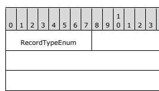 information about the **Remoting Type** information of the **Members**. This record can be used when the information is deemed unnecessary because it is known out of band or can be inferred from context.

| 1              | 2                    | 3   |    |    |    |    |    |    |    |    |    |    |    |    |    |    |    |    |    |    |    |
|----------------|----------------------|-----|----|----|----|----|----|----|----|----|----|----|----|----|----|----|----|----|----|----|----|
| 0              | 1                    | 2   | 3  | 4  | 5  | 6  | 7  | 8  | 9  | 0  | 1  | 2  | 3  | 4  | 5  | 6  | 7  | 8  | 9  | 0  | 1  |
| RecordTypeEnum | ClassInfo (variable) |     |    |    |    |    |    |    |    |    |    |    |    |    |    |    |    |    |    |    |    |
|                | ...                  |     |    |    |    |    |    |    |    |    |    |    |    |    |    |    |    |    |    |    |    |
|                | LibraryId            |     |    |    |    |    |    |    |    |    |    |    |    |    |    |    |    |    |    |    |    |

RecordTypeEnum (1 byte): A RecordTypeEnumeration value that identifies the record type. Its value MUST be 3.

ClassInfo (variable): A ClassInfo structure that provides information about the name and Members of the Class.

LibraryId (4 bytes): An INT32 value (as specified in [MS-DTYP] section 2.2.22) that references a BinaryLibrary record by its Library ID. The ID MUST be a positive integer. A BinaryLibrary record with the LibraryId MUST appear earlier in the **serialization stream**.

## 2.3.2.3 Systemclasswithmembersandtypes

The SystemClassWithMembersAndTypes record is less verbose than ClassWithMembersAndTypes. It does not contain a LibraryId. This record implicitly specifies that the Class is in the **System Library**.

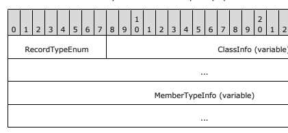

RecordTypeEnum (1 byte): A RecordTypeEnumeration value that identifies the record type. Its value MUST be 4.

ClassInfo (variable): A ClassInfo structure that provides information about the name and **Members**
of the Class.

MemberTypeInfo (variable): A MemberTypeInfo structure that provides information about the Remoting Type of the Members.

## 2.3.2.4 Systemclasswithmembers

| 1                             | 2                    | 3   |    |    |    |    |    |    |    |    |    |    |    |    |    |    |    |    |    |    |    |
|-------------------------------|----------------------|-----|----|----|----|----|----|----|----|----|----|----|----|----|----|----|----|----|----|----|----|
| 0                             | 1                    | 2   | 3  | 4  | 5  | 6  | 7  | 8  | 9  | 0  | 1  | 2  | 3  | 4  | 5  | 6  | 7  | 8  | 9  | 0  | 1  |
| RecordTypeEnum                | ClassInfo (variable) |     |    |    |    |    |    |    |    |    |    |    |    |    |    |    |    |    |    |    |    |
| ...                           |                      |     |    |    |    |    |    |    |    |    |    |    |    |    |    |    |    |    |    |    |    |
| MemberTypeInfo (variable) ... |                      |     |    |    |    |    |    |    |    |    |    |    |    |    |    |    |    |    |    |    |    |

The SystemClassWithMembers record is less verbose than ClassWithMembersAndTypes. It does not contain a LibraryId or the information about the **Remoting Types** of the **Members**. This record implicitly specifies that the Class is in the **System Library**. This record can be used when the information is deemed unnecessary because it is known out of band or can be inferred from context.

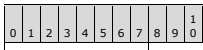

0 1 2 3 4 5 6 7 8 9

2 0 1 2 3 4 5 6 7 8 9

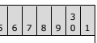

RecordTypeEnum ClassInfo (variable)

RecordTypeEnum (1 byte): A RecordTypeEnumeration value that identifies the record type. Its value MUST be 2.

ClassInfo (variable): A ClassInfo structure that provides information about the name and Members of the Class.

## 2.3.2.5 Classwithid

The ClassWithId record is the most compact. It has no metadata. It refers to metadata defined in SystemClassWithMembers, SystemClassWithMembersAndTypes, ClassWithMembers, or ClassWithMembersAndTypes record. 

| 1              | 2          | 3   |    |    |    |    |    |    |    |    |    |    |    |    |    |    |    |    |    |    |    |    |    |    |    |    |    |    |    |    |    |
|----------------|------------|-----|----|----|----|----|----|----|----|----|----|----|----|----|----|----|----|----|----|----|----|----|----|----|----|----|----|----|----|----|----|
| 0              | 1          | 2   | 3  | 4  | 5  | 6  | 7  | 8  | 9  | 0  | 1  | 2  | 3  | 4  | 5  | 6  | 7  | 8  | 9  | 0  | 1  | 2  | 3  | 4  | 5  | 6  | 7  | 8  | 9  | 0  | 1  |
| RecordTypeEnum | ObjectId   |     |    |    |    |    |    |    |    |    |    |    |    |    |    |    |    |    |    |    |    |    |    |    |    |    |    |    |    |    |    |
| ...            | MetadataId |     |    |    |    |    |    |    |    |    |    |    |    |    |    |    |    |    |    |    |    |    |    |    |    |    |    |    |    |    |    |
| ...            |            |     |    |    |    |    |    |    |    |    |    |    |    |    |    |    |    |    |    |    |    |    |    |    |    |    |    |    |    |    |    |

RecordTypeEnum (1 byte): A RecordTypeEnumeration value that identifies the record type. The value MUST be 1.

ObjectId (4 bytes): An INT32 value (as specified in [MS-DTYP] section 2.2.22) that uniquely identifies the object in the **serialization stream**.

MetadataId (4 bytes): An INT32 value (as specified in [MS-DTYP] section 2.2.22) that references one of the other Class records by its ObjectId. A SystemClassWithMembers, SystemClassWithMembersAndTypes, ClassWithMembers, or ClassWithMembersAndTypes record with the value of this field in its **ObjectId** field MUST appear earlier in the serialization stream.

## 2.4 Array Records

This section defines **Array** records that represent Array instances. [MS-NRTP] section 3.1.5.1.7, describes the mechanism to map an Array instance to a record defined in this section. Items of an Array MUST be **serialized** as records following the Array record, as specified in section 2.7. The number of records that contain the Array items depends on the type of Array record. For the ArraySingleObject, ArraySinglePrimitive, and ArraySingleString records, the number of records containing Array items MUST be equal to the value of the **Length** field of the **ArrayInfo** field. For BinaryArray records, the number of records containing Array items MUST be equal to the product of the values contained in the **Lengths** field of the BinaryArray record. In the cases where an item of an Array can contain a **Null Object**, multiple ObjectNull records in sequence MAY be represented by a single ObjectNullMultiple (section 2.5.5) or ObjectNullMultiple256 (section 2.5.6) record. Each of these records contains a **NullCount** field that states how many ObjectNull records that the record represents. For the purpose of calculating the number of records, a single ObjectNullMultiple or ObjectNullMultiple256 record is counted as many times as the value specified in the **NullCount** field.<6>

## 2.4.1 Enumerations 2.4.1.1 Binaryarraytypeenumeration

The BinaryArrayTypeEnumeration is used to denote the type of an **Array**. The size of the enumeration is 1 byte. It is used by the Array records.

| Constant/value      | Description                                                                                                |
|---------------------|------------------------------------------------------------------------------------------------------------|
| Single              | A single-dimensional Array.                                                                                |
| 0 Jagged            | An Array whose elements are Arrays. The elements of a jagged Array can be of different                     |
| 1                   | dimensions and sizes.                                                                                      |
| Rectangular         | A multi-dimensional rectangular Array.                                                                     |
| 2 SingleOffset      | A single-dimensional offset.                                                                               |
| 3 JaggedOffset      | A jagged Array where the lower bound index is greater than 0.                                              |
| 4 RectangularOffset | Multi-dimensional Arrays where the lower bound index of at least one of the dimensions is  greater than 0. |
| 5                   |                                                                                                            |

## 2.4.2 Common Definitions 2.4.2.1 Arrayinfo

| 1               | 2   | 3   |    |    |    |    |    |    |    |    |    |    |    |    |    |    |    |    |    |    |    |    |    |    |    |    |    |    |    |    |    |
|-----------------|-----|-----|----|----|----|----|----|----|----|----|----|----|----|----|----|----|----|----|----|----|----|----|----|----|----|----|----|----|----|----|----|
| 0               | 1   | 2   | 3  | 4  | 5  | 6  | 7  | 8  | 9  | 0  | 1  | 2  | 3  | 4  | 5  | 6  | 7  | 8  | 9  | 0  | 1  | 2  | 3  | 4  | 5  | 6  | 7  | 8  | 9  | 0  | 1  |
| ObjectId Length |     |     |    |    |    |    |    |    |    |    |    |    |    |    |    |    |    |    |    |    |    |    |    |    |    |    |    |    |    |    |    |

The ArrayInfo is a common structure that is used by **Array** records. ObjectId (4 bytes): An INT32 value (as specified in [MS-DTYP] section 2.2.22) that uniquely identifies the Array instance in the **serialization stream**. The ID MUST be a positive integer. An implementation MAY use any algorithm to generate the unique IDs.<7>
Length (4 bytes): An INT32 value (as specified in [MS-DTYP] section 2.2.22) that specifies the number of items in the Array. The value MUST be 0 or a positive integer.

## 2.4.3.1 Binaryarray

BinaryArray is the most general form of **Array** records. The record is more verbose than the other Array records. 

0 1 2 3 4 5 6 7 8 9

1 0 1 2 3 4 5 6 7 8 9

2 0 1 2 3 4 5 6 7 8 9

3 0 1

| RecordTypeEnum             | ObjectId                          |      |
|----------------------------|-----------------------------------|------|
| ...                        | BinaryArrayTypeEnum               | Rank |
| ...                        | Lengths (variable)                |      |
| ...                        |                                   |      |
| LowerBounds (variable) ... |                                   |      |
| TypeEnum                   | AdditionalTypeInfo (variable) ... |      |

RecordTypeEnum (1 byte): A RecordTypeEnumeration value that identifies the record type. Its value MUST be 7.

ObjectId (4 bytes): An INT32 value (as specified in [MS-DTYP] section 2.2.22) that uniquely identifies the Array in the **serialization stream**. The value MUST be a positive integer. An implementation MAY use any algorithm to generate the unique IDs.<8>
BinaryArrayTypeEnum (1 byte): A BinaryArrayTypeEnumeration value that identifies the type of the Array.

Rank (4 bytes): An INT32 value (as specified in [MS-DTYP] section 2.2.22) that specifies the rank 
(number of dimensions) of the Array. The value MUST be 0 or a positive integer.

Lengths (variable): A sequence of INT32 values (as specified in [MS-DTYP] section 2.2.22) that specifies the length of each of the dimensions of the Array. The number of values MUST be equal to the value specified in the **Rank** field. Each value of the sequence MUST be 0 or a positive integer.

LowerBounds (variable): A sequence of INT32 values (as specified in [MS-DTYP] section 2.2.22) 
that specifies the lower bound (first index) of each of the dimensions of the Array. The number of values MUST be equal to the value specified in the **Rank** field. If the value of the BinaryArrayTypeEnum field is SingleOffset, JaggedOffset, or RectangularOffset, this field MUST be present in the serialization stream; otherwise, this field MUST NOT be present in the serialization stream.

TypeEnum (1 byte): A BinaryTypeEnum value that identifies the **Remoting Type** of the Array item. AdditionalTypeInfo (variable): Information about the Remoting Type of the Array item in addition to the information provided in the **TypeEnum** field. For the BinaryTypeEnum values of Primitive, SystemClass, Class, or PrimitiveArray, this field contains additional information about the Remoting Type. For the BinaryTypeEnum value of Primitive and PrimitiveArray, this field specifies the actual **Primitive Type** that uses the PrimitiveTypeEnum. For the BinaryTypeEnum value of SystemClass, this field specifies the name of the Class. For the BinaryTypeEnum value of Class, this field specifies the name of the Class and the **Library** ID. The following table enumerates additional information that is required for each BinaryType enumeration.

| BinaryTypeEnum   | AdditionalTypeInfo                                            |
|------------------|---------------------------------------------------------------|
| Primitive        | PrimitiveTypeEnum                                             |
| Object           | None                                                          |
| String           | None                                                          |
| SystemClass      | String (Class name as specified in [MS-NRTP] section 2.2.1.2) |
| Class            | ClassTypeInfo                                                 |
| ObjectArray      | None                                                          |
| StringArray      | None                                                          |
| PrimitiveArray   | PrimitiveTypeEnum                                             |

If the BinaryTypeEnum value of the **TypeEnum** field is Object, String, ObjectArray, or StringArray, this field MUST NOT be present in the serialization stream. If the BinaryTypeEnum value is Primitive, the PrimitiveTypeEnumeration value in AdditionalTypeInfo MUST NOT be Null (17) or String (18).

## 2.4.3.2 Arraysingleobject

The ArraySingleObject record contains a single-dimensional **Array** in which each **Member** record MAY contain any **Data Value**.

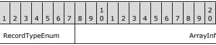

0 1 2 3 4 5 6 7 8 9

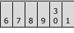

RecordTypeEnum (1 byte): A RecordTypeEnumeration value that identifies the record type. The value MUST be 16.

ArrayInfo (8 bytes): An ArrayInfo structure that specifies the ID and the length of the Array instance.

## 2.4.3.3 Arraysingleprimitive

The ArraySinglePrimitive record contains a single-dimensional **Array** in which all **Members** are Primitive Value.

| 2 0   | 1   | 2   | 3   | 4   | 5   | 6   | 7   | 8   | 9   |
|-------|-----|-----|-----|-----|-----|-----|-----|-----|-----|
| ...   |     |     |     |     |     |     |     |     |     |

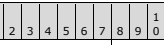

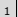

0 1 2 3 4 5 6 7 8 9 2 0 1 2 3 4 5 6 7 8 9 3 0 1
RecordTypeEnum ArrayInfo

... PrimitiveTypeEnum

RecordTypeEnum (1 byte): A RecordTypeEnumeration value that identifies the record type. The value MUST be 15.

ArrayInfo (8 bytes): An ArrayInfo structure that specifies the ID and the length of the Array instance.

PrimitiveTypeEnum (1 byte): A PrimitiveTypeEnumeration value that identifies the **Primitive Type**
of the items of the Array. The value MUST NOT be 17 (Null) or 18 (String).

This record MUST be followed by a sequence of MemberPrimitiveUnTyped records that contain values whose Primitive Type is specified by the **PrimitiveTypeEnum** field. The number of records in the sequence MUST match the value specified in the **Length** field of ArrayInfo.

## 2.4.3.4 Arraysinglestring

The ArraySingleString record contains a single-dimensional **Array** whose items are String values.

|                | 1         | 2   | 3   |    |    |    |    |    |    |    |    |    |    |    |    |    |    |    |    |    |    |    |    |    |    |    |    |    |    |    |    |
|----------------|-----------|-----|-----|----|----|----|----|----|----|----|----|----|----|----|----|----|----|----|----|----|----|----|----|----|----|----|----|----|----|----|----|
| 0              | 1         | 2   | 3   | 4  | 5  | 6  | 7  | 8  | 9  | 0  | 1  | 2  | 3  | 4  | 5  | 6  | 7  | 8  | 9  | 0  | 1  | 2  | 3  | 4  | 5  | 6  | 7  | 8  | 9  | 0  | 1  |
| RecordTypeEnum | ArrayInfo |     |     |    |    |    |    |    |    |    |    |    |    |    |    |    |    |    |    |    |    |    |    |    |    |    |    |    |    |    |    |
|                | ...       |     |     |    |    |    |    |    |    |    |    |    |    |    |    |    |    |    |    |    |    |    |    |    |    |    |    |    |    |    |    |
| ...            |           |     |     |    |    |    |    |    |    |    |    |    |    |    |    |    |    |    |    |    |    |    |    |    |    |    |    |    |    |    |    |

RecordTypeEnum (1 byte): A RecordTypeEnumeration value that identifies the record type. The value MUST be 17.

ArrayInfo (8 bytes): An ArrayInfo structure that specifies the ID and the length of the Array instance.

## 2.5 Member Reference Records

Arrays and classes are containers of **Member** values; that is, graph nodes that represent instances of Arrays and Classes that have outbound edges. The Member values are the graph nodes that are destinations for the outbound edges. In the **serialization stream**, the Member values follow the Array and the Class records. The Member values are **serialized** by using the Member Reference records.

## 2.5.1 Memberprimitivetyped

The MemberPrimitiveTyped record contains a **Primitive Type** value other than String. The mechanism to serialize a **Primitive Value** is described in [MS-NRTP] section 3.1.5.1.8. 

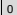

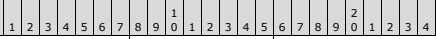

0 1 2 3 4 5 6 7 8 9 3 0 1
RecordTypeEnum PrimitiveTypeEnum Value (variable)
...

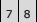

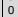

RecordTypeEnum (1 byte): A RecordTypeEnumeration value that identifies the record type. The value MUST be 8.

PrimitiveTypeEnum (1 byte): A PrimitiveTypeEnumeration value that specifies the Primitive Type of data that is being transmitted. This field MUST NOT contain a value of 17 (Null) or 18 (String).

Value (variable): The value whose type is inferred from the **PrimitiveTypeEnum** field as specified in the table in section 2.1.2.3.

## 2.5.2 Memberprimitiveuntyped

The MemberPrimitiveUnTyped record is the most compact record to represent a **Primitive Type** value. This type of record does not have a RecordTypeEnum to indicate the record type. The record MUST be used when a Class Member or **Array** item is a Primitive Type. Because the containing Class or Array record specifies the Primitive Type of each Member, the Primitive Type is not respecified along with the value. Also, the **Primitive Values** cannot be referenced by any other record; therefore it does not require an ObjectId. This record has no field besides the value. The mechanism to serialize a Primitive Value is described in [MS-NRTP] section 3.1.5.1.8.

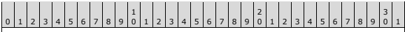

| Value (variable)   |
|--------------------|

Value (variable): A Primitive Type value other than String.

## 2.5.3 Memberreference

The MemberReference record contains a reference to another record that contains the actual value. The record is used to **serialize** values of a Class Member and **Array** items. The mechanism to serialize a Class instance is described in [MS-NRTP] section 3.1.5.1.6. The mechanism to serialize an Array instance is described in [MS-NRTP] section 3.1.5.1.7.

| 1              |       |    |    |    |    |    |    |    |    |    |    |    |    |    |    |    |    |    |    |
|----------------|-------|----|----|----|----|----|----|----|----|----|----|----|----|----|----|----|----|----|----|
| 0              | 1     | 2  | 3  | 4  | 5  | 6  | 7  | 8  | 9  | 0  | 1  | 2  | 3  | 4  | 5  | 6  | 7  | 8  | 9  |
| RecordTypeEnum | IdRef |    |    |    |    |    |    |    |    |    |    |    |    |    |    |    |    |    |    |
| ...            |       |    |    |    |    |    |    |    |    |    |    |    |    |    |    |    |    |    |    |

0 1 2 3 4 5 6 7 8 9

1

0 1 2 3 4 5 6 7 8 9

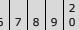

0 1 2 3 4 5 6 7 8 9

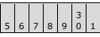

RecordTypeEnum (1 byte): A RecordTypeEnumeration value that identifies the record type. The value MUST be 9.

IdRef (4 bytes): An INT32 value (as specified in [MS-DTYP] section 2.2.22) that is an ID of an object defined in another record.

 The value MUST be a positive integer.

 A Class, Array, or BinaryObjectString record MUST exist in the **serialization stream** with the value as its ObjectId. Unlike other ID references, there is no restriction on where the record that defines the ID appears in the serialization stream; that is, it MAY appear after the referencing record.<9>

## 2.5.4 Objectnull

The ObjectNull record contains a **Null Object**. The mechanism to **serialize** a Null Object is described in [MS-NRTP] section 3.1.5.1.12.

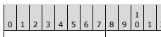

0 1 2 3 4 5 6 7 8 9 2 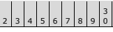

0 1

RecordTypeEnum (1 byte): A RecordTypeEnumeration value that identifies the record type. The value MUST be 10.

## 2.5.5 Objectnullmultiple

The ObjectNullMultiple record provides a more compact form for multiple consecutive Null records 

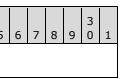 than using individual ObjectNull records. The mechanism to serialize a **Null Object** is described in [MS-NRTP] section 3.1.5.1.12.

| [MS-NRTP] section 3.1.5.1.12. 1   | 2         |    |    |    |    |    |    |    |    |    |    |    |    |    |    |    |    |    |    |    |    |    |    |    |    |    |    |    |    |
|-----------------------------------|-----------|----|----|----|----|----|----|----|----|----|----|----|----|----|----|----|----|----|----|----|----|----|----|----|----|----|----|----|----|
| 0                                 | 1         | 2  | 3  | 4  | 5  | 6  | 7  | 8  | 9  | 0  | 1  | 2  | 3  | 4  | 5  | 6  | 7  | 8  | 9  | 0  | 1  | 2  | 3  | 4  | 5  | 6  | 7  | 8  | 9  |
| RecordTypeEnum                    | NullCount |    |    |    |    |    |    |    |    |    |    |    |    |    |    |    |    |    |    |    |    |    |    |    |    |    |    |    |    |
| ...                               |           |    |    |    |    |    |    |    |    |    |    |    |    |    |    |    |    |    |    |    |    |    |    |    |    |    |    |    |    |

RecordTypeEnum (1 byte): A RecordTypeEnumeration value that identifies the record type. The value MUST be 14.

NullCount (4 bytes): An INT32 value (as specified in [MS-DTYP] section 2.2.22) that is the count of the number of consecutive Null Objects. The value MUST be a positive integer.

## 2.5.6 Objectnullmultiple256

The ObjectNullMultiple256 record provides the most compact form for multiple, consecutive Null records when the count of Null records is less than 256. The mechanism to serialize a **Null Object** is described in [MS-NRTP] section 3.1.5.1.12.

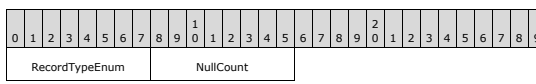

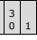

RecordTypeEnum (1 byte): A RecordTypeEnumeration value that identifies the record type. The value MUST be 13.

NullCount (1 byte): A BYTE value (as specified in [MS-DTYP] section 2.2.6) that is the count of the number of consecutive Null objects. The value MUST be in the range of 0 to 255, inclusive.

## 2.5.7 Binaryobjectstring

The BinaryObjectString record identifies an object as a String object, and contains information about it. The mechanism to **serialize** a string is described in [MS-NRTP] section 3.1.5.1.11.

| 1              | 2                | 3   |    |    |    |    |    |    |    |    |    |    |    |    |    |    |    |    |    |    |    |    |    |    |    |    |    |    |    |    |    |
|----------------|------------------|-----|----|----|----|----|----|----|----|----|----|----|----|----|----|----|----|----|----|----|----|----|----|----|----|----|----|----|----|----|----|
| 0              | 1                | 2   | 3  | 4  | 5  | 6  | 7  | 8  | 9  | 0  | 1  | 2  | 3  | 4  | 5  | 6  | 7  | 8  | 9  | 0  | 1  | 2  | 3  | 4  | 5  | 6  | 7  | 8  | 9  | 0  | 1  |
| RecordTypeEnum | ObjectId         |     |    |    |    |    |    |    |    |    |    |    |    |    |    |    |    |    |    |    |    |    |    |    |    |    |    |    |    |    |    |
| ...            | Value (variable) |     |    |    |    |    |    |    |    |    |    |    |    |    |    |    |    |    |    |    |    |    |    |    |    |    |    |    |    |    |    |
| ...            |                  |     |    |    |    |    |    |    |    |    |    |    |    |    |    |    |    |    |    |    |    |    |    |    |    |    |    |    |    |    |    |

RecordTypeEnum (1 byte): A RecordTypeEnumeration value that identifies the record type. The value MUST be 6.

ObjectId (4 bytes): An INT32 value (as specified in [MS-DTYP] section 2.2.22) that uniquely identifies the string instance in the **serialization stream**. The value MUST be a positive integer. An implementation MAY use any algorithm to generate the unique IDs.<10>
Value (variable): A LengthPrefixedString value.

## 2.6 Other Records

The following sections define the records that are not part of any of the previous categories.

## 2.6.1 Serializationheaderrecord

|                | 1   | 2            | 3   |    |    |    |    |    |    |    |    |    |    |    |    |    |    |    |    |    |    |    |    |    |    |    |    |    |    |    |    |
|----------------|-----|--------------|-----|----|----|----|----|----|----|----|----|----|----|----|----|----|----|----|----|----|----|----|----|----|----|----|----|----|----|----|----|
| 0              | 1   | 2            | 3   | 4  | 5  | 6  | 7  | 8  | 9  | 0  | 1  | 2  | 3  | 4  | 5  | 6  | 7  | 8  | 9  | 0  | 1  | 2  | 3  | 4  | 5  | 6  | 7  | 8  | 9  | 0  | 1  |
| RecordTypeEnum |     | RootId       |     |    |    |    |    |    |    |    |    |    |    |    |    |    |    |    |    |    |    |    |    |    |    |    |    |    |    |    |    |
| ...            |     | HeaderId     |     |    |    |    |    |    |    |    |    |    |    |    |    |    |    |    |    |    |    |    |    |    |    |    |    |    |    |    |    |
| ...            |     | MajorVersion |     |    |    |    |    |    |    |    |    |    |    |    |    |    |    |    |    |    |    |    |    |    |    |    |    |    |    |    |    |
| ...            |     | MinorVersion |     |    |    |    |    |    |    |    |    |    |    |    |    |    |    |    |    |    |    |    |    |    |    |    |    |    |    |    |    |
| ...            |     |              |     |    |    |    |    |    |    |    |    |    |    |    |    |    |    |    |    |    |    |    |    |    |    |    |    |    |    |    |    |

The SerializationHeaderRecord record MUST be the first record in a binary **serialization**. This record has the major and minor version of the format and the IDs of the top object and the headers. RecordTypeEnum (1 byte): A RecordTypeEnumeration value that identifies the record type. The value MUST be 0.

RootId (4 bytes): An INT32 value (as specified in [MS-DTYP] section 2.2.22) that identifies the root of the graph of nodes. The value of the field is set as follows:
 If a BinaryMethodCall record is present in the **serialization stream** and if there is no MethodCallArray record following it, the value of this field MUST be 0; if a MethodCallArray record follows the BinaryMethodCall record, the value of this field MUST contain the ObjectId of the MethodCallArray.

 If a BinaryMethodReturn record is present in the serialization stream and if there is no MethodReturnCallArray record following it, the value of this field MUST be 0; if a MethodReturnCallArray record follows the BinaryMethodReturn record, the value of this field MUST contain the ObjectId of the MethodReturnCallArray.

 If neither the BinaryMethodCall nor BinaryMethodReturn record is present in the serialization stream, the value of this field MUST contain the ObjectId of a Class, **Array**, or BinaryObjectString record contained in the serialization stream.

HeaderId (4 bytes): An INT32 value (as specified in [MS-DTYP] section 2.2.22) that identifies the Array that contains the header objects. The value of the field is set as follows:
 If a BinaryMethodCall record is present in the serialization stream and if there is no MethodCallArray record following it, the value of this field MUST be 0; if a MethodCallArray record follows the BinaryMethodCall record, the value of this field MUST be -1.

 If a BinaryMethodReturn record is present in the serialization stream and if there is no MethodReturnCallArray record following it, the value of this field MUST be 0; if a MethodReturnCallArray record follows the BinaryMethodReturn record, the value of this field MUST be -1.

 If neither the BinaryMethodCall nor BinaryMethodReturn record is present in the serialization stream, the value of this field MUST contain the ObjectId of a Class, Array , or BinaryObjectString record that is contained in the serialization stream.

The field MUST be ignored on read.

MajorVersion (4 bytes): An INT32 value (as specified in [MS-DTYP] section 2.2.22) that identifies the major version of the format. The value of this field MUST be 1.

MinorVersion (4 bytes): An INT32 value (as specified in [MS-DTYP] section 2.2.22) that identifies the minor version of the protocol. The value of this field MUST be 0.

## 2.6.2 Binarylibrary

The BinaryLibrary record associates an INT32 ID (as specified in [MS-DTYP] section 2.2.22) with a Library name. This allows other records to reference the Library name by using the ID. This approach reduces the wire size when there are multiple records that reference the same Library name.

| 1              | 2                      | 3   |    |    |    |    |    |    |    |    |    |    |    |    |    |    |    |    |    |    |    |    |    |    |    |    |    |    |    |    |    |
|----------------|------------------------|-----|----|----|----|----|----|----|----|----|----|----|----|----|----|----|----|----|----|----|----|----|----|----|----|----|----|----|----|----|----|
| 0              | 1                      | 2   | 3  | 4  | 5  | 6  | 7  | 8  | 9  | 0  | 1  | 2  | 3  | 4  | 5  | 6  | 7  | 8  | 9  | 0  | 1  | 2  | 3  | 4  | 5  | 6  | 7  | 8  | 9  | 0  | 1  |
| RecordTypeEnum | LibraryId              |     |    |    |    |    |    |    |    |    |    |    |    |    |    |    |    |    |    |    |    |    |    |    |    |    |    |    |    |    |    |
| ...            | LibraryName (variable) |     |    |    |    |    |    |    |    |    |    |    |    |    |    |    |    |    |    |    |    |    |    |    |    |    |    |    |    |    |    |
| ...            |                        |     |    |    |    |    |    |    |    |    |    |    |    |    |    |    |    |    |    |    |    |    |    |    |    |    |    |    |    |    |    |

RecordTypeEnum (1 byte): A RecordTypeEnumeration value that identifies the record type. The value MUST be 12.

LibraryId (4 bytes): An INT32 value (as specified in [MS-DTYP] section 2.2.22) that uniquely identifies the Library name in the **serialization stream**. The value MUST be a positive integer. An implementation MAY use any algorithm to generate the unique IDs.<11>
LibraryName (variable): A LengthPrefixedString value that represents the Library name. The format of the string is specified in [MS-NRTP] section 2.2.1.3.

## 2.6.3 Messageend

The MessageEnd record marks the end of the **serialization stream**.

#  0 1 2 3 4 5 6 7 8 9 2 0 1 2 3 4 5 6 7 8 9 3 0 1

RecordTypeEnum RecordTypeEnum (1 byte): A RecordTypeEnumeration value that identifies the record type. The value MUST be 11.

## 2.7 Binary Record Grammar

This section specifies the grammar using the Augmented Backus-Naur Form (ABNF) syntax specified in [RFC4234] that defines how the records can appear in the serialization stream.

| [RFC4234] that defines how the records can appear in the serialization stream. ABNF productions Meaning ABNF productions  = SerializationHeader remotingMessage *(referenceable)  (methodCall/methodReturn)  *(referenceable)  MessageEnd  methodCall = 0*1(BinaryLibrary)  BinaryMethodCall  0*1(callArray) methodReturn = 0*1(BinaryLibrary)  BinaryMethodReturn  0*1(callArray) callArray = 0*1(BinaryLibrary)  ArraySingleObject  *(memberReference) memberReference = 0*1(BinaryLibrary)  (MemberPrimitiveUnTyped / MemberPrimitiveTyped / MemberReference /  BinaryObjectString / nullObject /Classes) nullObject = ObjectNull / ObjectNullMultiple / ObjectNullMultiple256 referenceable = Classes/Arrays/BinaryObjectString  Classes = 0*1(BinaryLibrary)  (ClassWithId / ClassWithMembers/ ClassWithMembersAndTypes /  SystemClassWithMembers / SystemClassWithMembersAndTypes)  *(memberReference) Arrays = 0*1(BinaryLibrary)  ((ArraySingleObject *(memberReference)) / (ArraySinglePrimitive  *(MemberPrimitiveUnTyped)) /  (ArraySingleString *(BinaryObjectString/MemberReference/nullObject)) / (BinaryArray*(memberReference)) )   |
|-----------------------------------------------------------------------------------------------------------------------------------------------------------------------------------------------------------------------------------------------------------------------------------------------------------------------------------------------------------------------------------------------------------------------------------------------------------------------------------------------------------------------------------------------------------------------------------------------------------------------------------------------------------------------------------------------------------------------------------------------------------------------------------------------------------------------------------------------------------------------------------------------------------------------------------------------------------------------------------------------------------------------------------------------------------------------------------------------------------------------------------------------------|

## 3 Structure Examples

This sample illustrates the message exchanged when a **Remote Method** is invoked as specified in [MS-NRTP] section 3.3.4.2. The data model is used to describe the information to perform the Remote Method invocation and the results of the invocation, as specified in [MS-NRTP] section 3.1.1. The client invokes a method "SendAddress" on a remote **Server Type** "DOJRemotingMetadata.MyServer" and passes the following Address object (Street = "One Microsoft Way", City = "Redmond", State = "WA" and Zip = "98054") as an argument. The remote Server Type is accessible at a relative URI "MyServer.Rem" hosted on a server named "maheshdev2" and listening on port 8080. The server receives the request message, reads the argument passed in the message, and then invokes the method with the **de-serialized** argument. The server then embeds the Return Value of "Address received" in the response message to the client.

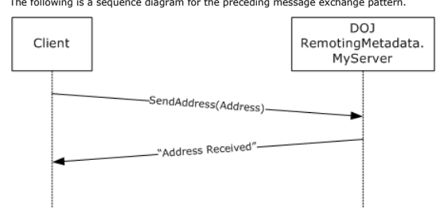

Figure 2: Sequence diagram of the message exchanged when a Remote Method is invoked The MessageContent data sent on the network is as follows.

| 0000 00 01 00 00 00 FF FF FF FF 01 00 00 00 00 00 00 ÿÿÿÿ 0010 00 15 14 00 00 00 12 0B 53 65 6E 64 41 64 64 72 SendAddr 0020 65 73 73 12 6F 44 4F 4A 52 65 6D 6F 74 69 6E 67 ess.oDOJRemoting 0030 4D 65 74 61 64 61 74 61 2E 4D 79 53 65 72 76 65 Metadata.MyServe 0040 72 2C 20 44 4F 4A 52 65 6D 6F 74 69 6E 67 4D 65 r, DOJRemotingMe 0050 74 61 64 61 74 61 2C 20 56 65 72 73 69 6F 6E 3D tadata, Version= 0060 31 2E 30 2E 32 36 32 32 2E 33 31 33 32 36 2C 20 1.0.2622.31326, 0070 43 75 6C 74 75 72 65 3D 6E 65 75 74 72 61 6C 2C Culture=neutral, 0080 20 50 75 62 6C 69 63 4B 65 79 54 6F 6B 65 6E 3D PublicKeyToken= 0090 6E 75 6C 6C 10 01 00 00 00 01 00 00 00 09 02 00 null 00A0 00 00 0C 03 00 00 00 51 44 4F 4A 52 65 6D 6F 74 QDOJRemot 00B0 69 6E 67 4D 65 74 61 64 61 74 61 2C 20 56 65 72 ingMetadata, Ver 00C0 73 69 6F 6E 3D 31 2E 30 2E 32 36 32 32 2E 33 31 sion=1.0.2622.31 00D0 33 32 36 2C 20 43 75 6C 74 75 72 65 3D 6E 65 75 326, Culture=neu 00E0 74 72 61 6C 2C 20 50 75 62 6C 69 63 4B 65 79 54 tral, PublicKeyT 00F0 6F 6B 65 6E 3D 6E 75 6C 6C 05 02 00 00 00 1B 44 oken=null D 0100 4F 4A 52 65 6D 6F 74 69 6E 67 4D 65 74 61 64 61 OJRemotingMetada 0110 74 61 2E 41 64 64 72 65 73 73 04 00 00 00 06 53 ta.Address S 0120 74 72 65 65 74 04 43 69 74 79 05 53 74 61 74 65 treet.City.State 0130 03 5A 69 70 01 01 01 01 03 00 00 00 06 04 00 00 .Zip 0140 00 11 4F 6E 65 20 4D 69 63 72 6F 73 6F 66 74 20 ..One Microsoft  0150 57 61 79 06 05 00 00 00 07 52 65 64 6D 6F 6E 64 Way Redmond 0160 06 06 00 00 00 02 57 41 06 07 00 00 00 05 39 38 WA 98 0170 30 35 34 0B 054.   |
|---------------------------------------------------------------------------------------------------------------------------------------------------------------------------------------------------------------------------------------------------------------------------------------------------------------------------------------------------------------------------------------------------------------------------------------------------------------------------------------------------------------------------------------------------------------------------------------------------------------------------------------------------------------------------------------------------------------------------------------------------------------------------------------------------------------------------------------------------------------------------------------------------------------------------------------------------------------------------------------------------------------------------------------------------------------------------------------------------------------------------------------------------------------------------------------------------------------------------------------------------------------------------------------------------------------------------------------------------------------------------------------------------------------------------------------------------------------------------------------------------------------------------------------------------------------------------------------------------------------------|

Referencing section 2 for various message structures, the bytes listed in the preceding sample can be mapped to the logical Request message structure that is used by .NET Remoting to service the request. The logical Request message for Microsoft .NET Framework 1.1 is as follows.

Binary Serialization Format SerializationHeaderRecord: RecordTypeEnum: SerializedStreamHeader (0x00) TopId: 1 (0x1) HeaderId: -1 (0xFFFFFFFF) MajorVersion: 1 (0x1)
 MinorVersion: 0 (0x0) BinaryMethodCall: 
 RecordTypeEnum: BinaryMethodCall (0x21)
 MessageEnum: 00000014 NoArgs: (...............................0) 
 ArgsInline: (..............................0.) ArgsIsArray: (.............................1..) 
 ArgsInArray: (............................0...) NoContext: (...........................1....) 
 ContextInline: (..........................0.....) ContextInArray: (.........................0......) MethodSignatureInArray: (........................0.......) PropertyInArray: (.......................0........) NoReturnValue: (......................0.........) ReturnValueVoid: (.....................0..........) 
 ReturnValueInline: (....................0...........) ReturnValueInArray: (...................0............) 
 ExceptionInArray: (..................0.............) Reserved: (000000000000000000..............)
 MethodName: PrimitiveTypeEnum: String (0x12) Data: SendAddress TypeName: PrimitiveTypeEnum: String (0x12)
 Data: DOJRemotingMetadata.MyServer, DOJRemotingMetadata, Version=1.0.2616.21414, Culture=neutral, PublicKeyToken=null CallArray: ArraySingleObject: RecordTypeEnum: ArraySingleObject (0x10) ObjectId: 1 (0x01)
 Length: 1 (0x1) MemberReference:
 RecordTypeEnum: MemberReference (0x09)
 IdRef: 2 (0x02)
 BinaryLibrary: RecordTypeEnum: BinaryLibrary (0x0C) LibraryId: 3 (0x03) LibraryString: LibrayString:DOJRemotingMetadata, Version=1.0.2621.26113, Culture=neutral, PublicKeyToken=null ClassWithMembersAndTypes: RecordTypeEnum: ClassWithMembersAndTypes (0x05)
 ObjectId: 2 (0x02) Name: DOJRemotingMetadata.MyData NumMembers: 4 (0x04) MemberNames: Data: Street MemberNames:
 Data: City MemberNames:
 Data: State
 
.NET Remoting: Binary Format Data Structure Copyright © 2019 Microsoft Corporation Release: March 13, 2019 MemberNames:
 Data: Zip BinaryTypeEnumA: String (0x01)
String (0x01)
String (0x01) String (0x01)
 LibraryId: 3 (0x03)
 BinaryObjectString: RecordTypeEnum: BinaryObjectString (0x06) ObjectId: 04 (0x04) Length: 17 (0x11) Value: One Microsoft Way BinaryObjectString:
 RecordTypeEnum: BinaryObjectString (0x06) ObjectId: 05 (0x04)
 Length: 7 (0x07) Value: Redmond BinaryObjectString: RecordTypeEnum: BinaryObjectString (0x06) ObjectId: 06 (0x04)
 Length: 2 (0x02)
 Value: WA BinaryObjectString:
 RecordTypeEnum: BinaryObjectString (0x06) ObjectId: 07 (0x04) Length: 5 (0x05) Value: 98054 MessageEnd: RecordTypeEnum: MessageEnd (0x11)
The Server Type name, method name, and arguments are passed in a BinaryMethodCall structure. The MessageEnum record in BinaryMethodCall is used by the server to determine how to read the needed values. The ArgsInArray flag in this record is set to 1 because the argument passed to the method is not a **Primitive Type**. Because the client is not passing any extra data in the CallContext of the request, the NoContext flag in the MessageEnum record is also set to 1. This information, coupled with the fact that the operation is of type Request, is used by the server to infer that the MethodName, Server Type, and Argument are embedded in the BinaryMethodCall record itself. Because the argument Address is passed in the callArray, CallArray contains an ArraySingleObject as the root element, and the first entry in the **Array** is a MemberReference to the ClassWithMembersAndTypes record that contains the input argument passed. The **Library**, to which the ClassWithMembersAndTypes refers, appears next, and then the ClassWithMembersAndTypes record follows. All Members of Address are strings; therefore, the ClassWithMembersAndTypes record is followed by BinaryObjectString records for all of its Members. After it invokes the method and is ready to return the result of that invocation, the server crafts a Response message and sends the Return Value ("Address received") in that message. The network capture of the response message is as follows.

0000 00 00 00 00 00 00 00 00 00 01 00 00 00 00 00 00 ................ 0010 00 16 11 08 00 00 12 10 41 64 64 72 65 73 73 20 ........Address 0020 72 65 63 65 69 76 65 64 0B received. Binary Serialization Format SerializationHeaderRecord: RecordTypeEnum: SerializedStreamHeader (0x00) TopId: 0 (0x0) HeaderId: 0 (0x0)
 MajorVersion: 1 (0x1) MinorVersion: 0 (0x0) BinaryMethodReturn: 
 
.NET Remoting: Binary Format Data Structure Copyright © 2019 Microsoft Corporation Release: March 13, 2019

| RecordTypeEnum: BinaryMethodReturn (0x16)   |                       |
|---------------------------------------------|-----------------------|
| MessageEnum: 00000811                       |                       |
| NoArgs:                                     | ( 1)                  |
| ArgsInline:                                 | ( 0.)                 |
| ArgsIsArray:                                | ( 0..)                |
| ArgsInArray:                                | ( 0...)               |
| NoContext:                                  | ( 1 )                 |
| ContextInline:                              | ( 0 )                 |
| ContextInArray:                             | ( 0 )                 |
| MethodSignatureInArray: ( 0 )               |                       |
| PropertyInArray:                            | ( 0 )                 |
| NoReturnValue:                              | ( 0 )                 |
| ReturnValueVoid:                            | ( 0 )                 |
| ReturnValueInline:                          | ( 1 )                 |
| ReturnValueInArray:                         | ( 0 )                 |
| ExceptionInArray:                           | ( 0 )                 |
| Reserved:                                   | (000000000000000000 ) |
| ReturnValue:                                |                       |
| PrimitiveTypeEnum: String (0x12)            |                       |
| Data: Address received                      |                       |

Because it is a response, the server sends back a message with the operation flag set to "Response". The return argument is enclosed in a "BinaryMethodResponse" enclosure. The following flags in the MessageEnum record of **BinaryMethodResponse** field are set to 1. NoArgs: There are no output arguments. NoContext: Similar to the client, the server is not sending any additional data in CallContext. ReturnValueInline: Because the Return Value is a Primitive Type, it is contained in the BinaryMethodReturn record.

## 4 Security Considerations

Some of the structures contain fields that specify size information of the data in the serialization stream. The type of the size that specifies fields is INT32 (as specified in [MS-DTYP] section 2.2.22). The maximum value of these values can be as high as 0x7FFFFFFF. An implementation that consumes the stream either does not allocate memory based on the size information specified in the serialization stream, or ensures that the data in the serialization stream can be trusted.

| Type                 | Field       | Description                                                        |
|----------------------|-------------|--------------------------------------------------------------------|
| LengthPrefixedString | Length      | Size of the string                                                 |
| ArrayOfValueWithCode | Length      | Size of the Array                                                  |
| ClassInfo            | MemberCount | Number of Members                                                  |
| ArrayInfo            | Length      | Size of the Array                                                  |
| BinaryArray          | Rank        | Size of the Lengths and LowerBounds Arrays                         |
| BinaryArray          | Lengths     | Size of each dimension that would affect the net size of the Array |
| ObjectNullMultiple   | NullCount   | Number of Null Objects                                             |

The following table lists the structures with fields that specify size information. De-serialization of the serialization stream results in creating instances of **Remoting Types** whose information is provided in the serialization stream. It might be unsafe to create an instance of Remoting Types. An implementation protects against attacks where the serialization stream includes the unsafe Remoting Types. Such attacks can be mitigated by allowing the higher layer to configure a list of Remoting Types in an implementation-specific way and disallow **de-serialization** of any Remoting Type that is not in the list.

## 5 Appendix A: Product Behavior

The information in this specification is applicable to the following Microsoft products or supplemental software. References to product versions include updates to those products. This document specifies version-specific details in the Microsoft .NET Framework. For information about which versions of .NET Framework are available in each released Windows product or as supplemental software, see [MS-NETOD] section 4. The terms "earlier" and "later", when used with a product version, refer to either all preceding versions or all subsequent versions, respectively. The term "through" refers to the inclusive range of versions. Applicable Microsoft products are listed chronologically in this section.

 Microsoft .NET Framework 1.0 Microsoft .NET Framework 2.0 Microsoft .NET Framework 3.0 Microsoft .NET Framework 3.5 Microsoft .NET Framework 4.0 Microsoft .NET Framework 4.5 Microsoft .NET Framework 4.6 Microsoft .NET Framework 4.7 Microsoft .NET Framework 4.8 Exceptions, if any, are noted in this section. If an update version, service pack or Knowledge Base (KB) number appears with a product name, the behavior changed in that update. The new behavior also applies to subsequent updates unless otherwise specified. If a product edition appears with the product version, behavior is different in that product edition. Unless otherwise specified, any statement of optional behavior in this specification that is prescribed using the terms "SHOULD" or "SHOULD NOT" implies product behavior in accordance with the SHOULD or SHOULD NOT prescription. Unless otherwise specified, the term "MAY" implies that the product does not follow the prescription. <1> Section 2.1.1.5: In .NET Framework 1.0 and .NET Framework 1.1, the value of **Kind** is always set to 0 when writing. On reading, the value is ignored and assumed to be 0. <2> Section 2.2.1.1: The bit value GenericMethod is valid only with .NET Framework 2.0 and later versions. <3> Section 2.2.3.2: This is present only in .NET Framework 2.0 and later versions. <4> Section 2.3.1.1: Windows uses a single counter that counts from 1 to generate the ObjectId in the ClassInfo, ArrayInfo, BinaryObjectString, and BinaryArray records, and the LibraryId in the BinaryLibrary record. The maximum value is 2,147,483,647. If the object is of a **Remoting Type** that cannot be referenced in Windows, the negative of the counter value is used. <5> Section 2.3.1.1: In Windows, the order of the Members can vary for each occurrence of the record for a given class. <6> Section 2.4: Windows uses ObjectNullMultiple256 if the number of sequential **Null Objects** is 255 or fewer. Windows uses ObjectNullMultiple if the number of sequential Null Objects is greater than 255. <7> Section 2.4.2.1: Windows uses a single counter that counts from 1 to generate the ObjectId in the ClassInfo, ArrayInfo, BinaryObjectString, and BinaryArray records, and the LibraryId in the BinaryLibrary record. The maximum value is 2,147,483,647. <8> Section 2.4.3.1: Windows uses a single counter that counts from 1 to generate the ObjectId in the ClassInfo, ArrayInfo, BinaryObjectString, and BinaryArray records, and the LibraryId in the BinaryLibrary record. The maximum value is 2,147,483,647. <9> Section 2.5.3: Windows places the record that defines the ID before or after the referencing record. <10> Section 2.5.7: Windows uses a single counter that counts from 1 to generate the ObjectId in the ClassInfo, ArrayInfo, BinaryObjectString, and BinaryArray records, and the LibraryId in the BinaryLibrary record. The maximum value is 2,147,483,647. <11> Section 2.6.2: Windows uses a single counter that counts from 1 to generate the ObjectId in the ClassInfo, ArrayInfo, BinaryObjectString, and BinaryArray records, and the LibraryId in the BinaryLibrary record. The maximum value is 2,147,483,647. 

## 6 Change Tracking

This section identifies changes that were made to this document since the last release. Changes are classified as Major, Minor, or None. The revision class **Major** means that the technical content in the document was significantly revised. Major changes affect protocol interoperability or implementation. Examples of major changes are:
 A document revision that incorporates changes to interoperability requirements. A document revision that captures changes to protocol functionality.

The revision class **Minor** means that the meaning of the technical content was clarified. Minor changes do not affect protocol interoperability or implementation. Examples of minor changes are updates to clarify ambiguity at the sentence, paragraph, or table level. The revision class **None** means that no new technical changes were introduced. Minor editorial and formatting changes may have been made, but the relevant technical content is identical to the last released version. The changes made to this document are listed in the following table. For more information, please contact dochelp@microsoft.com.

| Section                         | Description                                                                              | Revision  class   |
|---------------------------------|------------------------------------------------------------------------------------------|-------------------|
| 2.1.2.2                         | 9220 : Updated the term "string" to "String" in the Description                          |                   |
| BinaryTypeEnumeration           | column for the SystemClass and StringArray rows of the table.                            | Major             |
| 2.3.1.2 MemberTypeInfo          | 9220 : Changed the description of the number of items in the  BinaryTypeEnums structure. | Major             |
| 5 Appendix A: Product  Behavior | Added .NET Framework v4.8 to the applicability list.                                     | Major             |

## 7 Index

A

| Applicability 10 ArgsInArray 20 ArgsInline 20 ArgsIsArray 20 Array records  common definitions 31  data types 12  enumerations (section 2.1.2 17, section 2.4.1 31)  overview 30  record definitions 32 ArrayInfo packet 31 ArrayOfValueWithCode packet 22 ArraySingleObject 17 ArraySingleObject packet 33 ArraySinglePrimitive 17 ArraySinglePrimitive packet 33 ArraySingleString 17 ArraySingleString packet 34   |
|-----------------------------------------------------------------------------------------------------------------------------------------------------------------------------------------------------------------------------------------------------------------------------------------------------------------------------------------------------------------------------------------------------------------------|

| C Change tracking 47 Char 19 Char packet 12 Class 18 Class records  data types 12  enumerations 17  overview 26  record definitions 28  structures 26 ClassInfo packet 26 ClassTypeInfo packet 16 ClassWithId 17 ClassWithId packet 30 ClassWithMembers 17 ClassWithMembers packet 29 ClassWithMembersAndTypes 17 ClassWithMembersAndTypes packet 28 Common data types 12 Common definitions 12 Common enumerations 17 ContextInArray 20 ContextInline 20   |
|-------------------------------------------------------------------------------------------------------------------------------------------------------------------------------------------------------------------------------------------------------------------------------------------------------------------------------------------------------------------------------------------------------------------------------------------------------------|

| Binary records grammar 39 BinaryArray 17 BinaryArray packet 32 BinaryLibrary 17 BinaryLibrary packet 38 BinaryMethodCall packet 23 BinaryMethodReturn packet 25 BinaryObjectString 17 BinaryObjectString packet 37 Boolean 19 Byte 19   |
|-----------------------------------------------------------------------------------------------------------------------------------------------------------------------------------------------------------------------------------------|

B
 
.NET Remoting: Binary Format Data Structure Copyright © 2019 Microsoft Corporation Release: March 13, 2019 D
DateTime 19 DateTime packet 13 Decimal 19 Decimal packet 16 Double 19 Double packet 12 E
Examples 40 Examples - structure 40 ExceptionInArray 20 F
Fields - vendor-extensible 11 G
GenericMethod 20 Glossary 6 Grammar - binary records 39 I
Implementer - security considerations 44 Informative references 9 Int16 19 Int32 19 Int64 19 Introduction 6 J
Jagged 31 JaggedOffset 31

| Member reference records 34  data types 12  enumerations 17 MemberPrimitiveTyped 17 MemberPrimitiveTyped packet 34 MemberPrimitiveUnTyped packet 35 MemberReference 17 MemberReference packet 35 MemberTypeInfo packet 27 MessageEnd 17 MessageEnd packet 39 Method invocation records  data types 12  enumerations (section 2.1.2 17, section 2.2.1 20)  overview 20   |
|-------------------------------------------------------------------------------------------------------------------------------------------------------------------------------------------------------------------------------------------------------------------------------------------------------------------------------------------------------------------------|

L
LengthPrefixedString packet 14 Localization 11 M
 record definitions 23 structures 22 MethodCall 17 MethodReturn 17 MethodSignatureInArray 20

## N

NoArgs 20 NoContext 20 NoReturnValue 20 Normative references 9 Null 19 O
Object 18 ObjectArray 18 ObjectNull 17 ObjectNull packet 36 ObjectNullMultiple 17 ObjectNullMultiple packet 36 ObjectNullMultiple256 17 ObjectNullMultiple256 packet 36 Other records (section 2.1.1 12, section 2.6 37)
Overview (synopsis) 9 P
Primitive 18 PrimitiveArray 18 Product behavior 45 PropertiesInArray 20

## R

Rectangular 31 RectangularOffset 31 References 9 informative 9 normative 9 Relationship to other protocols 10 Relationship to protocols and other structures 10 ReturnValueInArray 20 ReturnValueInline 20 ReturnValueVoid 20

## S

SByte 19 Security 44 Security - implementer considerations 44 SerializationHeaderRecord packet 37 SerializedStreamHeader 17 Single (section 2.1.2.3 19, section 2.4.1.1 31)
Single packet 13 SingleOffset 31 String (section 2.1.2.2 18, section 2.1.2.3 19) StringArray 18 StringValueWithCode packet 22 Structure examples 40 Structures 12 SystemClass 18 SystemClassWithMembers 17 
.NET Remoting: Binary Format Data Structure Copyright © 2019 Microsoft Corporation Release: March 13, 2019 SystemClassWithMembers packet 29 SystemClassWithMembersAndTypes 17 SystemClassWithMembersAndTypes packet 29 T
TimeSpan 19 TimeSpan packet 13 Tracking changes 47 U
UInt16 19 UInt32 19 UInt64 19 V
ValueWithCode packet 22 Vendor-extensible fields 11 Versioning 11

# MS-NRBF documentation originally converted to Markdown with [marker](https://github.com/vikparuchuri/marker)
# Rewritten completely by hand by [Micah Benac](https://github.com/OfficialSirH)